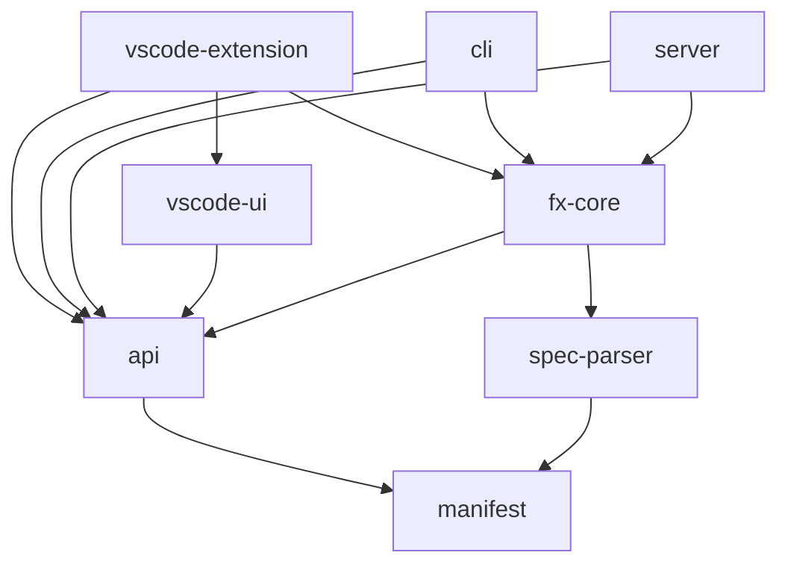

# Microsoft 365 Agents Toolkit — AI Agent Configuration

## Project overview

PNPM monorepo (Lerna) building the Microsoft 365 Agents Toolkit: a VS Code extension,
CLI tools, and core engine for scaffolding, provisioning, deploying, and publishing
Microsoft 365 / Teams agents.

Core packages: `fx-core`, `cli`, `vscode-extension`, `server`, `api`, `manifest`. An in-place refactor toward a v4 architecture is in progress; v4 design decisions are being collected as ADRs under [`docs/02-architecture/`](../docs/02-architecture/README.md). Until those ADRs land, treat the existing code shape as authoritative for maintenance and treat [`docs/02-architecture/`](../docs/02-architecture/README.md) as the source for any new structural decision. Maintenance and refactor work coexist in the same packages.

## Global behavioral principles

These apply to every contribution — human or AI agent — across all packages and
skills. Adapted from [Karpathy's
guidelines](https://github.com/multica-ai/andrej-karpathy-skills/blob/main/skills/karpathy-guidelines/SKILL.md).
They bias toward caution over speed; use judgment for trivial changes (typos,
dependency bumps, lint cleanup).

1. **Think before coding.** State assumptions explicitly. If multiple readings of
   the request exist, surface them instead of silently picking one. If something
   is unclear, stop and ask — do not paper over confusion with code. If a
   simpler approach exists, say so and push back when warranted.
2. **Simplicity first.** Write the minimum code that solves the problem. No
   speculative features, no abstractions for single-use code, no "flexibility"
   that was not requested, no error handling for impossible scenarios. If 200
   lines could be 50, rewrite.
3. **Surgical changes.** Touch only what the request requires. Do not refactor
   or reformat adjacent code, do not delete pre-existing dead code unasked.
   Match existing style even if you would do it differently. Remove only the
   imports/variables/functions that your own changes orphaned. Every changed
   line should trace directly to the request.
4. **Goal-driven execution.** Restate the task as a verifiable outcome before
   writing code (e.g. "fix bug" → "write a failing test that reproduces it,
   then make it pass"). For multi-step work, write a brief plan with a
   verification step per item, then loop until each is green. Strong success
   criteria let you finish without constant clarification.

The per-PR gates in [`.github/skills/vibe-coding/SKILL.md`](skills/vibe-coding/SKILL.md)
operationalize these principles for behavior-changing or structural-shape work;
the principles still apply to maintenance and to PRD / scenario work.

## Where to start (router)

| User intent | Entry skill / doc |
|---|---|
| Add or update engine-neutral PRD / scenario design before specs or code | **`prd-ux-design`** skill |
| Add or change behavior, or refactor toward a structural shape governed by ADRs in [`docs/02-architecture/`](../docs/02-architecture/README.md) | **`vibe-coding`** skill |
| Per-package coding conventions and cross-cutting security rules | `.github/instructions/*.instructions.md` (auto-loaded by `applyTo`) |

Pure maintenance (a bug fix, dependency bump, lint cleanup, or internal refactor that does not change behavior or structural shape) has no dedicated workflow skill — follow the coding-style, architecture, and package-specific rules below.

Generic expert knowledge (TypeScript, debugging, security, test design) is **not**
packaged as skills — the AI applies general expertise constrained by the instructions
and specs in this repo.

## Last todo of every code-modifying turn

Affected tests green.

---

# Coding Style Guidelines

When generating or editing code in this repository:

- **Line Endings**: Use LF (Unix-style) line endings for all source code files. Exception: Use CRLF for localization files under `**/package.nls.*.json` only.
- **Indentation**: Use 2 spaces for TypeScript/JavaScript files
- **Quotes**: Use double quotes for strings in TypeScript/JavaScript

Full conventions live in `.github/instructions/` — auto-loaded for matching file patterns. Key rules:

- **Copyright header** on every `.ts` file.
- **`Result<T, FxError>`** from `neverthrow` — never `throw` for expected failures.
- **`UserError`** for user-fixable issues; **`SystemError`** for infra failures.
- **Strict TypeScript** — no `as` casts; prefer type predicates and discriminated unions.
- **EAFP** filesystem pattern — no existence checks before read/write (TOCTOU).
- **No floating promises** — every promise must be `await`ed or `return`ed.
- **Conventional commits** — `type(scope): subject`.
- **User-facing strings** — always `getLocalizedString("key")`, never raw strings.
- **No secrets in logs** — always `maskSecret()` before logging.

---

# Architecture overview

The monorepo holds two independent groups of packages. Do not mix them.

## Group 1 — Toolkit engine (what users install)

Three user-facing surfaces sit on a single engine. The engine is consumed via `fx-core` + the shared types in `api`; surfaces should not implement domain logic.

| Package | Role | Depends on (intra-repo) |
|---|---|---|
| `packages/vscode-extension` | VS Code surface (commands, tree view, webviews) | `api`, `fx-core`, `vscode-ui` |
| `packages/cli` | Command-line surface | `api`, `fx-core` |
| `packages/server` | JSON-RPC server consumed by the Visual Studio client | `api`, `fx-core` |
| `packages/fx-core` | Engine — scaffold / provision / deploy / publish, drivers, lifecycle | `api`, `spec-parser` |
| `packages/api` | Public TS types and interfaces shared by surfaces and engine | `manifest` |
| `packages/manifest` | Generated types + converters for Teams / Declarative Agent / API Plugin manifests | — |
| `packages/spec-parser` | OpenAPI → API Plugin spec parsing | `manifest` |
| `packages/vscode-ui` | Reusable prompt / quick-pick helpers for VS Code surfaces | `api` |
| `packages/mcp-server` | The toolkit's own MCP server for AI clients | — |

Dependency direction (arrow = "depends on"; downstream → upstream). Upstream packages must build first.



Practical consequences (see also Common pitfalls below):
- `manifest` and `api` are upstream of `fx-core`; rebuild them before testing anything that imports them.
- All three surfaces talk to the engine via `fx-core` + `api` only.

## Group 2 — App-runtime SDKs (deprecating, do not extend)

These were shipped into apps the toolkit scaffolds. **All four are deprecated** with sunset dates already announced in their READMEs. Do not add new features here. Bug fixes only, and only when there is no reasonable alternative; prefer redirecting users to the migration target.

| Package | npm / NuGet name | Sunset | Migration target |
|---|---|---|---|
| `packages/sdk` | `@microsoft/teamsfx` | 2026-07 | `@microsoft/agents-hosting` |
| `packages/sdk-react` | `@microsoft/teamsfx-react` | 2026-07 | Copy hooks into the app's own source |
| `packages/adaptivecards-tools-sdk` | `@microsoft/adaptivecards-tools` | 2026-09 | `adaptivecards-templating` |
| `packages/dotnet-sdk` | `Microsoft.TeamsFx` | 2026-09 | (Blazor / TeamsFx .NET path being retired) |

None of these are imported by the engine (`fx-core` / `api` / `manifest`), so changes here cannot affect the toolkit itself — they only affect already-scaffolded apps pinning the old version.

## Tooling-only packages

Build / lint / test infrastructure and legacy companions, not part of the shipped engine and not part of the runtime SDKs: `eslint-plugin-teamsfx`, `prettier-config`, `extra-shot-mocha`, `metrics-ts`, `tests`, `function-extension`, `simpleauth`.

## Key file locations

| What | Where |
|------|-------|
| Core engine | `packages/fx-core/src/` |
| VS Code extension | `packages/vscode-extension/src/` |
| Templates | `templates/vsc/{ts,js,python}/`, `templates/vs/csharp/` |
| Instructions (per-package conventions) | `.github/instructions/*.instructions.md` |
| Skills (workflows) | `.github/skills/*/SKILL.md` |
| Plans | `.dev/plans/` |

---

# Package-Specific Instructions

Detailed instructions for individual packages are available in `.github/instructions/`:

| Scope | Instructions File | Covers |
|-------|-------------------|--------|
| `@microsoft/app-manifest` (packages/manifest) | `.github/instructions/manifest.instructions.md` | `TeamsManifest`, `DeclarativeAgentManifest`, `APIPluginManifest`, `AppManifestUtils`, Wrappers |
| All `packages/**/*.{ts,tsx}` | `.github/instructions/security.instructions.md` | Webview XSS, command injection, path traversal, untrusted JSON, cryptography |

> **Note**: When working with a specific package, read the corresponding instructions file for detailed documentation about the package's architecture, APIs, and patterns

---

# Manifest Package Quick Reference

The manifest package (`packages/manifest`) provides TypeScript types for Microsoft 365 app manifests:

| Manifest Type | Purpose | Wrapper | Latest Type |
|---------------|---------|---------|-------------|
| **Teams Manifest** | Core M365 apps (bots, tabs, extensions) | `TeamsManifestWrapper` | `TeamsManifestLatest` |
| **Declarative Agent** | AI agents with instructions & actions | `DeclarativeAgentManifestWrapper` | `DeclarativeAgentManifestLatest` |
| **API Plugin** | REST API plugin capabilities | `PluginManifestWrapper` | `APIPluginManifestLatest` |

**Key utilities:**
- `AppManifestUtils` - Read/write/validate manifests
- `*Converter` classes - JSON ↔ typed object conversion
- Wrappers provide fluent APIs for manipulation

**Deprecated types** (use generated types instead):
- `TeamsAppManifest` → use `TeamsManifest`
- `DeclarativeCopilotManifestSchema` → use `DeclarativeAgentManifest`
- `PluginManifestSchema` → use `APIPluginManifest`
- `ManifestUtil` → use `AppManifestUtils`

**Schema upgrade guardrail (manifest package):**
- Run `node download.js` in `packages/manifest` before `npm run convert` to sync new schema folders.
- After conversion, update `src/generated-types/index.ts` so new versions are registered in converter maps, unions, and `*Latest` aliases (and re-export new schema enums/types when applicable).
- Do not leave new versions relying on fallback unchecked casts; validate parity with `npx mocha test/converterMapParity.test.ts`.

---

# Unit Testing Guidelines

## Test stack

- **Framework:** Mocha + Chai + Sinon (all packages).
- **Coverage:** NYC / Istanbul, 80% gate.
- **Test location:** `tests/unit/` mirroring `src/`.
- **Run:** `cd packages/<pkg> && npm run test:unit`.

When fixing unit tests for a package:

1. **Navigate to the package directory** before running tests
2. **Run the full test suite** to identify failures:
   ```bash
   npm run test:unit
   ```
3. **For large test suites or targeted debugging**, run specific test files directly:
   ```bash
   npx nyc mocha --no-timeouts --require ts-node/register <path_to_test_file_or_folder>
   ```
4. **Fix errors iteratively** - run tests after each fix to verify

> **Tip**: When there are many failing tests, start with the specific file causing issues to reduce feedback loop time.

---

# Template Maintenance Guidelines

Templates in this repository (located in `templates/`) are used when scaffolding.

## Template Locations
- `templates/` - Root location for all scaffolding templates
- `templates/src/` - Template metadata, question/template name definitions, and UI assets
- `templates/vsc/` - VS Code scaffolding templates (TypeScript, JavaScript, Python, and shared common)
- `templates/vs/` - Visual Studio scaffolding templates (C#)
- `templates/unused/` - Templates not currently in use but kept for reference, no need to update them

---

# Common pitfalls

- Rebuild `packages/api` before testing `fx-core` — it's upstream.
- Never edit `pnpm-lock.yaml` manually — run `pnpm install`.
- Unused variables must be prefixed with `_` (ESLint enforced).
