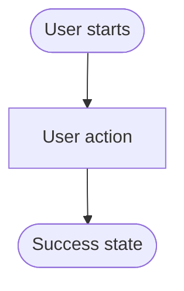

# Scenarios

This directory contains grouped product scenario artifacts. Scenario Markdown is the AI-primary source for behavior and validation intent. Scenario HTML is the human-readable view for reviewing concrete user flows and visual states.

## Directory groups

Use one product-flow group directory under `scenarios/`:

- [`da/`](da/) - Declarative Agent flows, such as create, test, provision, deploy, and publish DA scenarios.
- [`cea/`](cea/) - Custom Engine Agent flows.
- [`others/`](others/) - shared or uncategorized flows that are not DA or CEA specific.

Create a new group only when the existing groups would make ownership or test generation ambiguous. Group directories should not have their own README files; keep classification rules and format rules in this file so AI agents have one stable scenario entry point.

Each group directory contains same-basename scenario `.md` + optional `.html` pairs directly.

Each active scenario should use this pair when a human flow view is useful:

- `<group>/<scenario-slug>.md` - source of truth for AI agents, specs, UI test intent, and E2E test intent.
- `<group>/<scenario-slug>.html` - human-readable visual/state reference for the same scenario.

The Markdown file owns behavior. The HTML file helps humans inspect the flow, but must not introduce behavior that is missing from the Markdown source.

## Lifecycle subdirectories

A scenario's lifecycle state is determined by its file location, not by a metadata field. Each group directory may contain two optional subdirectories that hold non-live versions of scenarios:

- `<group>/<scenario-slug>.{md,html}` &mdash; **live**. The current behavior contract for shipped code.
- `<group>/draft/<scenario-slug>.{md,html}` &mdash; **draft**. A scenario being redesigned. PMs author drafts here when an already-shipped scenario needs to change because of a new feature. The draft becomes live only after engineering lands the implementing change. Drafts are listed in the product index so reviewers can track in-flight redesigns; they are not the behavior contract for shipped code.
- `<group>/archive/<scenario-slug>-YYYY-MM-DD.{md,html}` &mdash; **archive**. A snapshot of a previous live scenario, taken at the moment a new version is promoted. The date suffix is the UTC archive date; append `-2`, `-3` for multiple archives on the same day. Archives preserve historical behavior contracts and are intentionally not listed in the product index.

Invariants:

- Each `<slug>` has at most one live file (`<group>/<slug>.md`) and at most one in-flight draft (`<group>/draft/<slug>.md`).
- The stable `SCN-<ID>` is preserved across draft, live, and archive copies; the same flow keeps the same scenario ID across redesigns.
- The Markdown/HTML pair always moves together; never archive or draft only one half.

Use the lifecycle workflow in the [`prd-ux-design`](../../../.github/skills/prd-ux-design/SKILL.md) skill (Phase 4a) to open a draft, iterate on it, promote it to live with archival of the previous version, or discard it.

## Markdown format

Use Markdown for content that AI agents need to read, trace, and transform into later specs or tests. Keep it explicit, stable, and easy to parse.

Required sections:

~~~markdown
# <Scenario title>

## Metadata

- Created: YYYY-MM-DDTHH:mm:ssZ
- Last updated: YYYY-MM-DDTHH:mm:ssZ
- PM owner: <owner-id or @handle>
- Engineer owner: <owner-id or @handle>
- Scenario group: da | cea | others | <approved-group>
- Scenario ID: SCN-<STABLE-ID>
- Visual/state reference: <scenario-slug>.html

## Scenario

Describe the user, trigger, goal, success state, and scope.

## Surfaces

List applicable surfaces such as VS Code, CLI interactive, CLI non-interactive, Visual Studio, or chat. State when a surface is not covered.

## States

List user-visible states such as empty, loading, success, error, cancellation, permission, or prerequisite states.

## Flow



## Validation notes

Record UI test intent, E2E test intent, expected traceability to PRD requirement IDs, future spec acceptance criteria, and known deferred validation.
~~~

Markdown rules:

- `PM owner` and `Engineer owner` values must resolve to an entry in [`../owner.md`](../owner.md) or to a GitHub handle. The scenario metadata names the owner directly; the lookup file is implicit and does not need to be cited in every scenario.
- A scenario does not link to a PRD in metadata. PRDs reference scenarios, not the other way around; if a scenario needs PRD context, link to it inline in the body where it matters.
- Use stable scenario IDs such as `SCN-CREATE-AGENT-FROM-TEMPLATE`; tests and future specs should be able to cite them.
- Keep happy paths, decisions, cancellation, recoverable errors, unrecoverable errors, and recovery actions in the Flow and Validation notes.
- Put Mermaid directly in the owning Markdown file. Do not create a separate `.mmd` file unless a future scenario becomes too large to read comfortably.
- Prefer simple headings, bullets, tables, and Mermaid. Avoid prose-only flows that hide test paths.
- Include enough detail for an AI agent to generate CLI E2E tests or VS Code UI tests without reading the HTML.

## HTML format

Use HTML for humans reviewing the concrete user flow and visual/state presentation. HTML should be compact, semantic, and linked to the same-basename Markdown source.

HTML rules:

- Use the same basename as the Markdown file, for example `create-da-with-mcp-server.md` and `create-da-with-mcp-server.html`.
- Link back to the owning Markdown source near the top of the page.
- Link back to [`index.html`](index.html) from the group HTML path as `../index.html` so reviewers can return to the product scenario index.
- Use `../../_assets/product-review/product-review.css` for page-level review layout. These styles are assets because they have low AI value and should not be embedded in scenario HTML.
- Use `../../_assets/scenario-components/scenario-components.js` and `../../_assets/scenario-components/scenario-components.css` for reusable VS Code-style flow controls instead of recreating Quick Pick, multi-select, input box, file picker, or Mermaid flow loading markup in each scenario page. The `docs/01-product/_assets/` folder is a static rendering bundle; AI agents should not read it for behavior — scenario behavior contracts live in the sibling `.md` files.
- Do not render the full Markdown file inside scenario HTML. HTML should concretize the Markdown flow with visual states and include a rendered Mermaid reference loaded from the owning Markdown source.
- Keep HTML as a human review aid. Any behavior, branching, validation rule, or test expectation shown in HTML must also exist in the Markdown file.
- Do not add per-page `<style>` or `<script>` blocks to re-implement layout, section collapse, card badges, or any presentation already provided by the shared scenario components. If a new shared behavior is needed, extend `scenario-components.{js,css}` so every scenario page benefits, instead of forking it inline.

### Scenario region structure

Author every top-level scenario region as:

```html
<section class="scenario-flow" aria-labelledby="…">
  <div class="section-head">
    <h2 id="…">…</h2>
    <p>Optional one-line description.</p>
  </div>
  <!-- region content: vscode-flow-grid, scenario-mermaid-flow, scenario-markdown-section, etc. -->
</section>
```

Why this exact shape: the shared script automatically wires every such section as collapsible (caret on the heading, click / Enter / Space toggles, hash navigation auto-expands the target). Pages with this structure get consistent navigation for free; pages that invent their own wrappers do not, and they also break the product-index hash links.

### Flow card kinds

Every `<article class="vscode-flow-card">` inside a `vscode-flow-grid` must carry `data-kind` so readers can instantly tell user steps apart from perceivable toolkit outputs. Use:

| `data-kind` | When to use | Optional qualifier |
|---|---|---|
| `action` | A user step the scenario asks the user to perform: Quick Pick, input box, file picker, command, button. | — |
| `outcome` | A perceivable end-of-flow result the toolkit produces: file written or modified, file opened in the editor, notification, hand-off, completion banner. | `data-severity="success" \| "info" \| "warning" \| "error"` to qualify the result. Default reads as a neutral `RESULT`. |
| `note` | Purely explanatory or contextual card with no user action and no perceivable side effect. | — |

Why this matters: scenarios mix decisions, follow-ups, and "this is what the user will end up with" cards in the same grid. Without the tag, a reviewer scanning the page can't tell at a glance which cards they need to walk through versus which cards describe the produced state. Badge text, badge color, and the colored left rail are all generated from these attributes by the shared CSS — never re-create the badge text inline, never restyle the rail per page, and never use color alone to convey the distinction in a screenshot.

## VS Code flow components

Use shared assets from [`../_assets/scenario-components/`](../_assets/scenario-components/README.md) to render VS Code-style scenario flow states and Mermaid references. These are static review components, not real VS Code controls. Customize titles, placeholder text, option labels, descriptions, paths, selected state, active rows, and button text with attributes.

Available components:

- `<vscode-single-select>` - VS Code single-selection Quick Pick.
- `<vscode-multi-select>` - VS Code multi-selection Quick Pick with selected count and confirmation button.
- `<vscode-input-box>` - VS Code input prompt. Add `error="..."` to render the input in its blocking validation state (red border + red-bordered message box below the input), replacing the default hint.
- `<vscode-file-select>` - VS Code file/single-select picker that can also show create-new or browse options.
- `<vscode-codelens-file>` - VS Code editor/file mock with a CodeLens action row.
- `<vscode-notification>` - VS Code notification/state mock with optional detail text and primary action.
- `<scenario-mermaid-flow>` - loads the first Mermaid code block from the owning scenario Markdown and renders it as the flow reference.

Usage rules:

- Add `<link rel="stylesheet" href="../../_assets/scenario-components/scenario-components.css">` and `<script type="module" src="../../_assets/scenario-components/scenario-components.js"></script>` to one-level group scenario HTML that uses these components.
- Define options as child `<vscode-option>` elements.
- Supported option attributes: `label`, `description`, `detail`, `meta`, `selected`, `active`, and `icon`.
- `meta` represents the option's Quick Pick group name (for example `Agents for Microsoft 365 Copilot`, `Apps for Microsoft 365`, `Use GitHub Copilot`). Set the same `meta` on each option in the group; the component renders the group label only on the first option of each contiguous group, matching VS Code Quick Pick behavior. Keep options sorted so options of the same group stay adjacent.
- Single-select options use VS Code-style item icons instead of checkboxes. Prefer the same icon IDs used in source Quick Pick labels, such as `teamsfx-agent`, `teamsfx-custom-copilot`, `teamsfx-graph-connector`, `microsoft365-agents-toolkit-teams`, `microsoft365-agents-office`, `question`, and `default`.
- File-select options use VS Code codicon names from source labels, including `file`, `new-file`, and `folder`. `icon="new"` remains an alias for `new-file`.
- Use `flow-index="1"`, `flow-index="2"`, and so on only when one scenario Markdown intentionally contains multiple Mermaid blocks for distinct flows. The default renders the first Mermaid block.
- Keep component labels aligned with the same scenario Markdown. If a component shows a branch, error, or validation expectation, the Markdown must describe it too.

Example:

```html
<link rel="stylesheet" href="../../_assets/scenario-components/scenario-components.css">
<script type="module" src="../../_assets/scenario-components/scenario-components.js"></script>

<vscode-single-select title="New Project" placeholder="Search project types">
  <vscode-option label="Declarative Agent" description="Create your own agent by declaring instructions, actions, and knowledge." meta="Agents for Microsoft 365 Copilot" icon="teamsfx-agent" selected></vscode-option>
  <vscode-option label="Custom Engine Agent" description="Build intelligent agent where you manage orchestration and provide your own LLM." icon="teamsfx-custom-copilot"></vscode-option>
</vscode-single-select>

<vscode-multi-select title="Select Operation(s) Copilot can interact with" placeholder="Search operations" selected-label="2 Selected" confirm-label="OK">
  <vscode-option label="add_issue_comment" description="Add a comment to a specific issue in a GitHub repository." selected></vscode-option>
  <vscode-option label="create_branch" description="Create a new branch in a GitHub repository."></vscode-option>
</vscode-multi-select>

<vscode-input-box title="Application Name" placeholder="Input an application name"></vscode-input-box>

<vscode-file-select title="Select the action manifest you want to update" placeholder="Search or type a new manifest name">
  <vscode-option label="ai-plugin.json" detail="c:\Users\example\project\appPackage" selected></vscode-option>
  <vscode-option label="Create a new ai-plugin.json" icon="new-file"></vscode-option>
  <vscode-option label="Browse..."></vscode-option>
</vscode-file-select>

<vscode-codelens-file title=".vscode/mcp.json" lens="⚡ ATK: Fetch action from MCP | Running | 44 tools | 2 prompts | More..." server="apigithubc" type="http" url="https://api.githubcopilot.com/mcp/"></vscode-codelens-file>

<vscode-notification title="Action added" message="Action &quot;github-actions&quot; added to the project successfully." action="View action manifest"></vscode-notification>

<scenario-mermaid-flow src="<scenario-slug>.md" title="SCN-..."></scenario-mermaid-flow>
```

Recommended HTML structure:

```html
<!doctype html>
<html lang="en">
<head>
  <meta charset="utf-8">
  <meta name="viewport" content="width=device-width, initial-scale=1">
  <title><Scenario title> Scenario</title>
  <link rel="stylesheet" href="../../_assets/product-review/product-review.css">
  <link rel="stylesheet" href="../../_assets/scenario-components/scenario-components.css">
  <script type="module" src="../../_assets/scenario-components/scenario-components.js"></script>
</head>
<body>
  <header>
    <p class="eyebrow">Scenario visual/state reference</p>
    <h1><Scenario title></h1>
    <p class="intro">
      This page references <a href="<scenario-slug>.md"><scenario-slug>.md</a> for behavior, flow, states, and validation intent.
    </p>
    <div class="legend" aria-label="Review links">
      <a class="link" href="../index.html">Back to product index</a>
    </div>
  </header>

  <main>
    <section class="scenario-flow" aria-labelledby="source-heading">
      <div class="section-head">
        <h2 id="source-heading">Markdown Flow Reference</h2>
        <p>Rendered from the Mermaid block in the same-name Markdown source.</p>
      </div>
      <scenario-mermaid-flow src="<scenario-slug>.md" title="SCN-..."></scenario-mermaid-flow>
    </section>
  </main>

  <footer>
    Scenario behavior belongs in <code><scenario-slug>.md</code>. This HTML visualizes the flow; it does not render or replace the Markdown contract.
  </footer>
</body>
</html>
```

## Review and navigation

- Update [`index.html`](index.html) whenever scenario HTML is added, removed, renamed, moved between scenario groups, or moved between live/draft/archive buckets.
- The product index lists human-readable scenario HTML only, split into two sections:
  - **Live** - `<group>/<slug>.html`, the shipped behavior-of-record flows.
  - **Drafts** - `<group>/draft/<slug>.html`, in-flight redesigns of already-shipped scenarios.
  - Archive HTML (`<group>/archive/*.html`) is intentionally not listed; reach it through repo navigation or the `Supersedes:` link in the current live scenario.
- The product index must not list Markdown files, README files, PRDs, backups, or renderer/tooling HTML.
- Use [`../_assets/product-artifact-viewer/index.html`](../_assets/product-artifact-viewer/index.html) for Markdown preview, but treat the Markdown source as the contract.