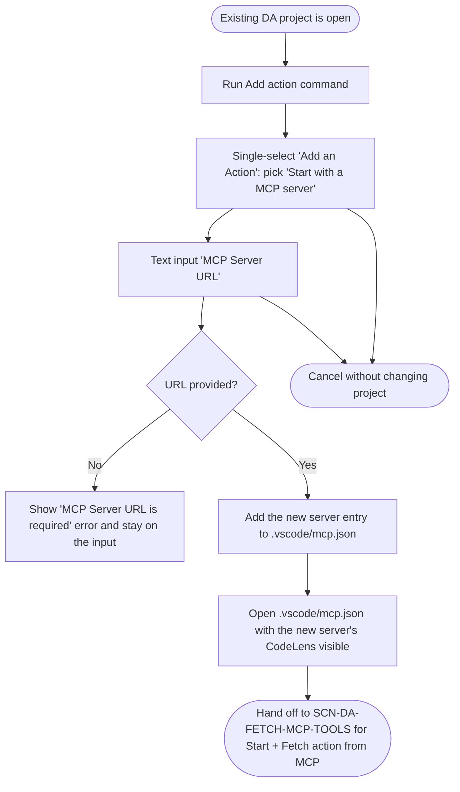
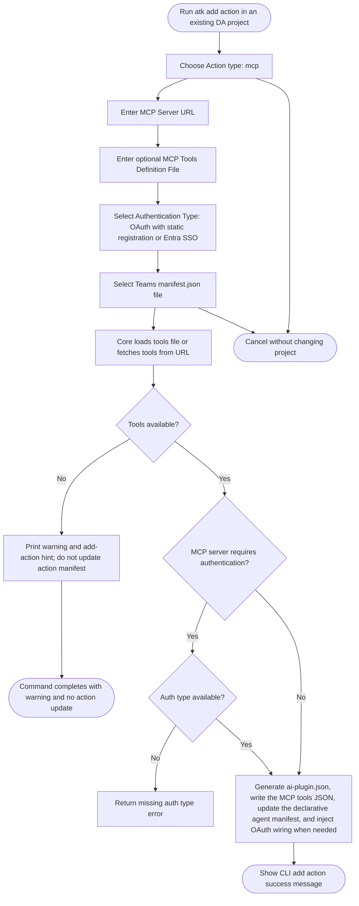
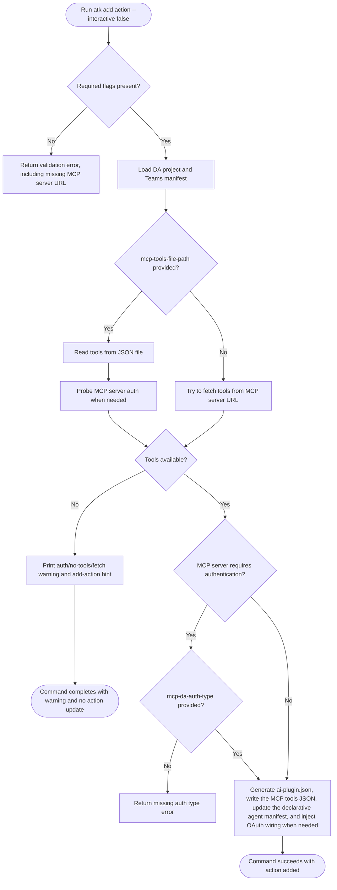

# Add MCP Action To Declarative Agent

## Metadata

- Created: 2026-05-20T00:00:00Z
- Last updated: 2026-05-20T00:00:00Z
- PM owner: summzhan
- Engineer owner: HuihuiWu-Microsoft, Alive-Fish
- Scenario group: da
- Scenario ID: SCN-DA-ADD-MCP-ACTION-TO-DA
- Visual/state reference: add-mcp-action-to-da.html

## Scenario

A developer has an existing Declarative Agent project and wants to wire a Microsoft 365 Copilot action that calls an MCP server. The two surfaces behave differently today:

- **VS Code**: the `Add action` UX runs `addPlugin` which only collects the MCP server URL and writes it into `.vscode/mcp.json`. No tool fetch, manifest selection, operation pick or auth pick happens during this scenario. The toolkit then opens `.vscode/mcp.json` so the developer can start the server and click `⚡ ATK: Fetch action from MCP` &mdash; everything from that click onward is owned by `SCN-DA-FETCH-MCP-TOOLS`.
- **CLI**: `atk add action --api-plugin-type mcp` is end-to-end. The CLI collects the URL (and optionally a tools file and auth type), fetches tools from the URL or reads the tools file, and writes the action manifest, MCP tools JSON, declarative agent manifest update, and OAuth provisioning wiring in a single command.

Success for VS Code means a server entry is added under `servers` in `.vscode/mcp.json` and that file is opened with the new entry's CodeLens visible. Success for CLI means an `ai-plugin.json` is created, an `mcp-tools-*.json` file is written, the declarative agent manifest is updated, and OAuth registration actions are injected when authentication is required.

The relevant CLI options remain unchanged:

- `api-plugin-type=mcp`
- required `mcp-da-server-url=<remote MCP server URL>`
- optional `mcp-tools-file-path` for authenticated or offline MCP tool definitions
- optional `mcp-da-auth-type`, with valid values `oauth` for `OAuth (with static registration)` and `entraSSO` for `Entra SSO`
- required project folder through `folder` / `projectPath`
- required Teams app manifest through `manifest-file` / `manifest-path`, defaulting to `./appPackage/manifest.json`

## Dependencies

- Requires: an existing Declarative Agent project with `appPackage/manifest.json` and a declarative agent manifest.
- VS Code precondition: the project is open, and the MCP-for-DA preview is enabled so `Start with a MCP server` shows up in the action-type picker.
- CLI precondition: the DA project path is supplied with `-f` / `--folder` or is the current project folder, and the manifest path is supplied with `-t` / `--manifest-file` or defaults to `./appPackage/manifest.json`.
- Produces (VS Code): a new server entry under `servers` in `.vscode/mcp.json` (`{ "type": "http", "url": ... }` keyed by the URL host) and that file opened in the editor with the `⚡ ATK: Fetch action from MCP` CodeLens visible.
- Produces (CLI): an updated DA manifest with the new action wired in, a new action manifest (`ai-plugin.json`), the captured MCP tool definitions as JSON, and OAuth registration wiring for provisioning when authentication is required.
- Post-step (VS Code): `SCN-DA-FETCH-MCP-TOOLS` handles the user starting the MCP server, clicking the ATK CodeLens, tool discovery, action manifest selection, operation pick, auth type selection, and the success notification.

## Surfaces

- VS Code: the `Add action` command (tree view, Command Palette, or right-click on the DA project) starts the add-action flow. The user picks `Start with a MCP server` and enters the MCP server URL. The toolkit writes the URL into `.vscode/mcp.json` and then opens that file in the editor. The fetch/update CodeLens flow that follows is owned by `SCN-DA-FETCH-MCP-TOOLS`.
- CLI interactive: current prompt-driven `atk add action` behavior. It asks for action type, MCP server URL, optional tools definition file, auth type, and Teams manifest path. It does not write to `.vscode/mcp.json`; it writes the action manifest and DA wiring directly.
- CLI non-interactive: current flag-driven `atk add action` behavior. It requires `--api-plugin-type mcp`, `--mcp-da-server-url`, `--manifest-file`, `--folder`, and `--interactive false`; it may use `--mcp-tools-file-path` and `--mcp-da-auth-type`.
- Visual Studio and chat: not covered by this draft scenario.

## States

- Entry: an existing DA project is available.
- VS Code action-type pick: the toolkit shows a single-select titled `Add an Action`. When the MCP-for-DA preview is enabled the list contains `Start with an OpenAPI Description Document` and `Start with a MCP server`. The user picks `Start with a MCP server`.
- VS Code server URL input: the toolkit shows a text input titled `MCP Server URL` with placeholder `Enter your MCP server URL(e.g. https://example-mcp.com)`. No tools-file-path or auth-type follow-up is asked in VS Code; those questions are CLI-only.
- VS Code write `.vscode/mcp.json`: the toolkit derives a server name from the URL host, ensures the name does not collide with an existing entry by appending a numeric suffix when needed, and adds an entry under `servers` with `type: "http"` and `url: <input>`. Existing servers in the file are preserved.
- VS Code open `.vscode/mcp.json`: the toolkit opens `.vscode/mcp.json` automatically so the user immediately sees the new server entry with the `⚡ ATK: Fetch action from MCP | ▷Start | More…` CodeLens row.
- CLI action source: the user or command chooses `api-plugin-type=mcp`.
- CLI tools input: the CLI uses the MCP server URL and optional `MCP Tools Definition File`; when no tools are available, it prints a warning and does not update the action manifest.
- CLI auth: the CLI prompts for `mcp-da-auth-type` in the MCP add-action path, but the value is only required when the MCP server requires authentication and tools are provided.
- CLI success with tools: the CLI creates an `ai-plugin.json`, writes an `mcp-tools-*.json` file, updates the declarative agent manifest, and injects OAuth registration follow-up actions when authentication is required.
- Recoverable error: missing MCP server URL, invalid tools file (CLI), missing auth type when required (CLI), invalid manifest file (CLI), no tools fetched (CLI), or invalid project path is shown with a same-flow recovery path. In VS Code, missing URL is the only error this scenario raises &mdash; tool-discovery and manifest-write errors belong to `SCN-DA-FETCH-MCP-TOOLS`.
- Cancellation: in VS Code, the user can cancel the action-type pick or the URL input; cancellation must not leave a partially written `.vscode/mcp.json`. In CLI, cancellation maps to the standard add-action cancellation.

## Flow

### VS Code add action flow



### CLI interactive add-action flow



### CLI non-interactive add-action flow



Example current non-interactive command:

```bash
atk add action --api-plugin-type mcp --mcp-da-server-url <server-url> -t ./appPackage/manifest.json -f <project-path> --interactive false
```

Authenticated or offline tool definitions can be supplied with:

```bash
atk add action --api-plugin-type mcp --mcp-da-server-url <server-url> --mcp-tools-file-path <tools.json> --mcp-da-auth-type oauth -t ./appPackage/manifest.json -f <project-path> --interactive false
```

## Validation notes

- VS Code UI test intent should trace to `SCN-DA-ADD-MCP-ACTION-TO-DA` and cover the `Add action` command, the `Add an Action` action-type pick (with and without the MCP-for-DA preview enabled), the `MCP Server URL` input including the empty-input recovery, the resulting `.vscode/mcp.json` write (new file vs append-to-existing, host-collision suffixing), and the auto-open of `.vscode/mcp.json` with the new server entry's CodeLens visible.
- The CodeLens click, tool fetch, action manifest selection, operation pick, auth type pick and success notification belong to `SCN-DA-FETCH-MCP-TOOLS`; VS Code UI tests for this scenario should stop after `.vscode/mcp.json` is opened.
- CLI E2E test intent should trace to `SCN-DA-ADD-MCP-ACTION-TO-DA` for interactive and non-interactive `atk add action --api-plugin-type mcp` paths.
- CLI validation should cover missing `--mcp-da-server-url`, invalid or unreadable `--mcp-tools-file-path`, missing `--mcp-da-auth-type` when authentication is required and tools are provided, invalid manifest path, and invalid DA project path.
- CLI current behavior should be validated as distinct from VS Code: the CLI does not write to `.vscode/mcp.json` and does not depend on `SCN-DA-FETCH-MCP-TOOLS`; it fetches tools and updates the action manifest in a single end-to-end command.
- Future spec acceptance criteria should trace to the related PRD requirement IDs once the dedicated PRD exists.