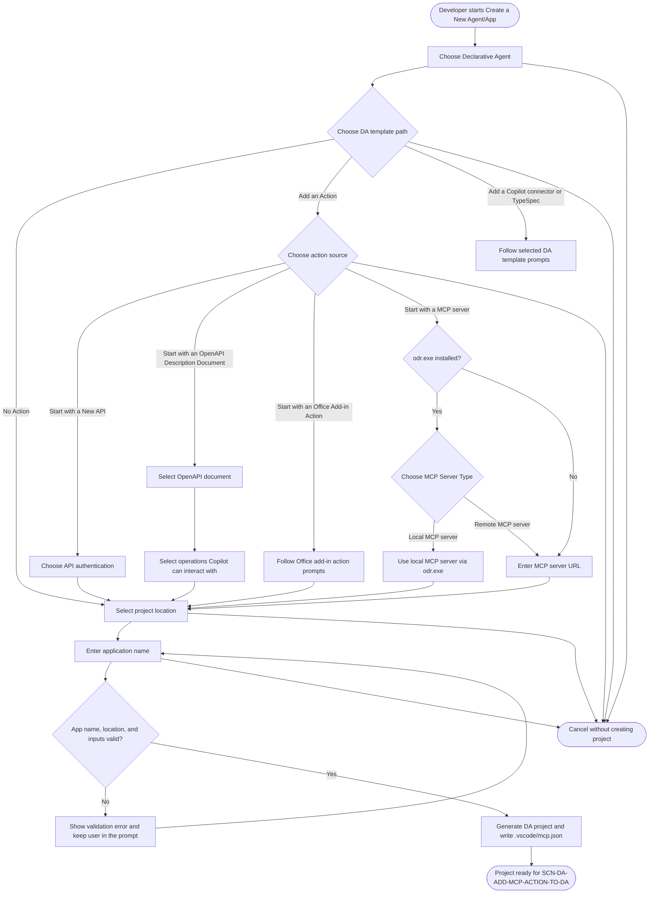
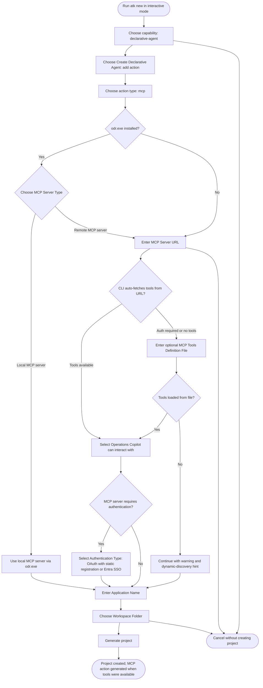
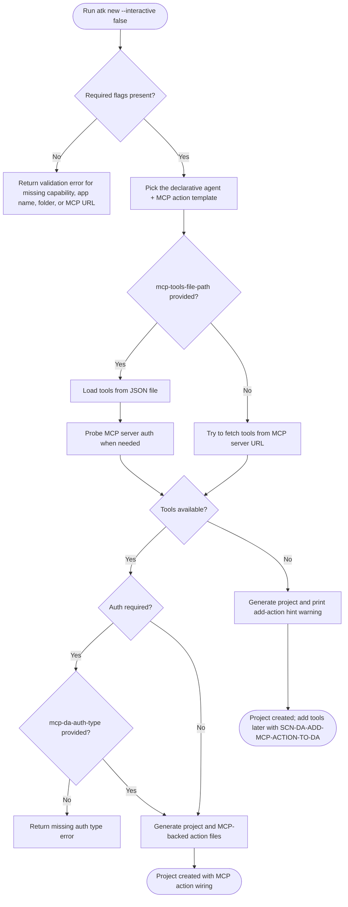

# Create Declarative Agent With MCP Server

## Metadata

- Created: 2026-05-20T00:00:00Z
- Last updated: 2026-05-20T00:00:00Z
- PM owner: summzhan
- Engineer owner: HuihuiWu-Microsoft, Alive-Fish
- Scenario group: da
- Scenario ID: SCN-DA-CREATE-WITH-MCP-SERVER
- Visual/state reference: create-da-with-mcp-server.html

## Scenario

A developer creates a Declarative Agent project that is connected to an MCP server. In VS Code, this scenario stops at a generated DA project with `.vscode/mcp.json`; adding MCP tools to the action manifest is handled by the dependent scenario `SCN-DA-ADD-MCP-ACTION-TO-DA`. In CLI, the current implementation has no CodeLens follow-up UX, so the create command also tries to fetch or load MCP tool definitions and may generate the MCP-backed action during project creation.

Success means the developer can choose the Declarative Agent path, choose `Add an Action`, choose `Start with a MCP server`, provide a remote MCP server URL, choose the project location, enter the application name, and generate a DA project. For VS Code, the project contains `.vscode/mcp.json` and is ready for `SCN-DA-ADD-MCP-ACTION-TO-DA`. For CLI, success may additionally include generated MCP action files when tools are available during `atk new`.

This scenario is grounded in the current create question tree and CLI options:

- `capability=declarative-agent`
- `with-plugin=yes`
- `api-plugin-type=mcp`
- `mcp-server-type=remote`
- `mcp-da-server-url=<remote MCP server URL>`
- required `app-name`
- required `folder`
- optional `mcp-tools-file-path` for authenticated or offline MCP tool definitions
- optional `mcp-da-auth-type`, with valid values `oauth` for `OAuth (with static registration)` and `entraSSO` for `Entra SSO`

## Dependencies

- Produces: a DA project folder with `appPackage/manifest.json`, a declarative agent manifest, and `.vscode/mcp.json` configured with the MCP server URL in the VS Code flow.
- Enables: `SCN-DA-FETCH-MCP-TOOLS` (VS Code discovery step that runs implicitly before action manifest selection) and `SCN-DA-ADD-MCP-ACTION-TO-DA`, which requires an existing DA project and, for VS Code, a configured `.vscode/mcp.json` entry.
- Does not include: the post-create VS Code CodeLens flow for selecting or creating an action manifest and choosing MCP operations. That belongs to `add-mcp-action-to-da.md`.

## Surfaces

- VS Code: primary guided creation experience using Quick Pick and input box states. It writes `.vscode/mcp.json` and prompts the user to start the MCP server and use the later fetch action flow.
- CLI interactive: current prompt-driven `atk new` behavior. It asks for the DA capability, action source, remote MCP server URL, optional tools file when tools are not auto-fetched, operation selection when tools are available, auth type when the MCP server requires authentication, app name, and folder.
- CLI non-interactive: current flag-driven `atk new` behavior. It requires `--capability declarative-agent`, `--with-plugin yes`, `--api-plugin-type mcp`, `--mcp-da-server-url`, `--app-name`, and `--folder`; it may use `--mcp-tools-file-path` and `--mcp-da-auth-type` for authenticated MCP servers.
- Visual Studio and chat: not covered by this draft scenario.

## States

- Entry: no project choice has been made; the user can choose `Declarative Agent` from the new project flow.
- Template decision: the user picks one of `No Action`, `Add an Action`, `Add a Copilot connector`, or `Start with TypeSpec for Microsoft 365 Copilot`.
- Action source decision: when adding an action, the user chooses `Start with a New API`, `Start with an OpenAPI Description Document`, `Start with an Office Add-in Action`, or `Start with a MCP server` when MCP for DA is enabled. Some options are gated by feature flags.
- MCP source: after `Start with a MCP server`, the toolkit checks whether `odr.exe` is installed on the user's machine. If `odr.exe` is present, the user is asked `MCP Server Type` and chooses `Local MCP server` or `Remote MCP server`. If `odr.exe` is not present, the prompt is skipped and the flow proceeds as if `Remote MCP server` was selected.
- Project input: the user enters the MCP server URL, picks the project location, then enters the app name before project generation.
- CLI tool discovery: the CLI attempts to fetch tools from the MCP server. If the server requires authentication or tools are not fetched, it can ask for `MCP Tools Definition File`.
- CLI tool selection: when tool definitions are available in the interactive create flow, the user can choose `Select Operation(s) Copilot can interact with`.
- CLI auth: when the MCP server requires authentication, the user is asked `Select Authentication Type` and chooses either `OAuth (with static registration)` or `Entra SSO`.
- VS Code success: the generated project is opened with `.vscode/mcp.json`; follow-up action manifest update belongs to `SCN-DA-ADD-MCP-ACTION-TO-DA`.
- CLI success with tools: project files, the action manifest (`ai-plugin.json`), the captured MCP tool definitions as JSON, and the MCP runtime wiring are generated during creation.
- CLI warning without tools: the project is created, but MCP action files may remain incomplete; the CLI prints a warning with the current hint command `atk add action --api-plugin-type mcp --mcp-da-server-url <server-url> --mcp-tools-file-path <path-to-tools-json> --interactive false`.
- Recoverable error: invalid app name, invalid or unavailable location, invalid MCP server URL, missing tools file, unreadable tools file, missing auth type when required, or missing required non-interactive option is shown with a same-flow recovery path.
- Cancellation: the user can cancel before project generation; cancellation must not create a partially accepted project.

## Flow

### VS Code create flow



### CLI interactive create flow



### CLI non-interactive create flow



Example current non-interactive command:

```bash
atk new -c declarative-agent --with-plugin yes --api-plugin-type mcp --mcp-server-type remote --mcp-da-server-url <server-url> -n <app-name> -f <folder> --interactive false
```

Authenticated or offline tool definitions can be supplied with:

```bash
atk new -c declarative-agent --with-plugin yes --api-plugin-type mcp --mcp-server-type remote --mcp-da-server-url <server-url> --mcp-tools-file-path <tools.json> --mcp-da-auth-type oauth -n <app-name> -f <folder> --interactive false
```

## Validation notes

- VS Code UI test intent should trace to `SCN-DA-CREATE-WITH-MCP-SERVER` and stop after project generation, `.vscode/mcp.json` creation, and the handoff into `SCN-DA-ADD-MCP-ACTION-TO-DA`.
- CLI E2E test intent should trace to `SCN-DA-CREATE-WITH-MCP-SERVER` for interactive and non-interactive `atk new` paths.
- CLI non-interactive validation should cover missing `--mcp-da-server-url` when `--api-plugin-type mcp` is used, unreadable `--mcp-tools-file-path`, missing `--mcp-da-auth-type` when auth is required and tools are provided, invalid app name, and invalid or unavailable target folder.
- Because current CLI creation may generate action files when tools are available, validation should assert both possible outcomes: generated MCP action wiring with tools, or a created project plus warning/hint when tools cannot be fetched.
- Future spec acceptance criteria should trace to the related PRD requirement IDs once the dedicated PRD exists.