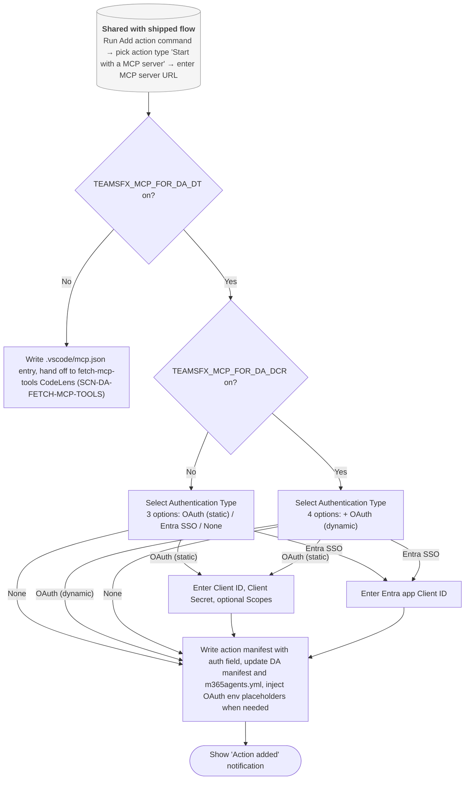
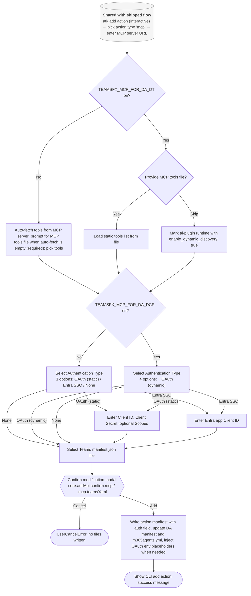
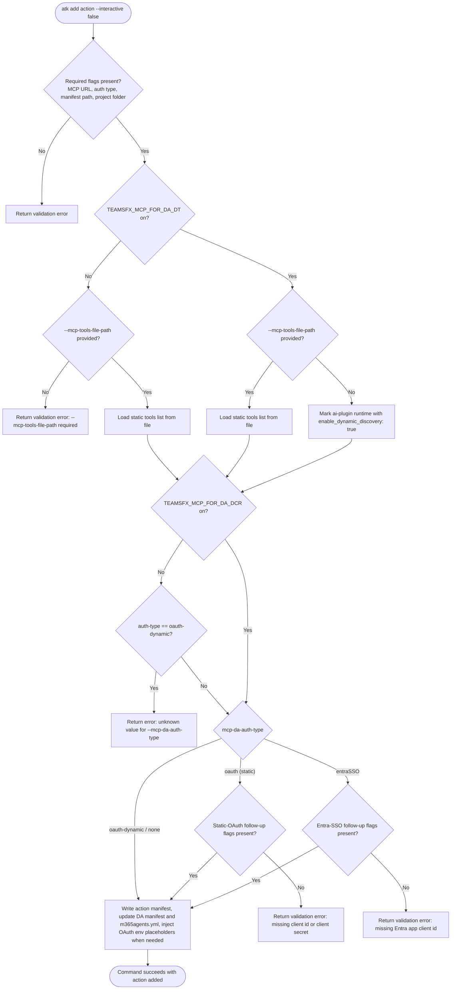

# Add MCP Action To Declarative Agent (draft)

## Metadata

- Created: 2026-05-20T00:00:00Z
- Last updated: 2026-05-20T00:00:00Z
- PM owner: summzhan
- Engineer owner: HuihuiWu-Microsoft, Alive-Fish
- Scenario group: da
- Scenario ID: SCN-DA-ADD-MCP-ACTION-TO-DA
- Visual/state reference: add-mcp-action-to-da.html

> **Draft note:** This draft redesigns the live [`../add-mcp-action-to-da.md`](../add-mcp-action-to-da.md). VS Code Add action now runs the full flow end-to-end (URL &rarr; auth type &rarr; conditional follow-up &rarr; write action manifest + DA manifest + yml), the same way CLI does. Static tool fetching is dropped; tool discovery is dynamic at runtime. The separate VS Code fetch-from-CodeLens scenario [`../fetch-mcp-tools.md`](../fetch-mcp-tools.md) is absorbed into this flow and will be archived when the redesign ships. Companion redesign: [`create-da-with-mcp-server.md`](create-da-with-mcp-server.md).

## Scenario

A developer has an existing Declarative Agent project and wants to wire a Microsoft 365 Copilot action that calls an MCP server. Both surfaces ask the same questions in the same order: MCP server URL, authentication type, and at most a couple of follow-up fields determined by the chosen authentication type. As soon as the last required answer is provided, the toolkit creates a new action manifest, updates the declarative agent manifest, and updates `m365agents.yml` to wire OAuth provisioning when the authentication type requires it &mdash; **VS Code does not ask for a manifest path and does not show a confirmation modal**, matching the live `updateActionWithMCP` flow. No static tool list is captured; the agent host discovers the MCP server's tools at runtime.

Success means that after the flow completes, the project's declarative agent manifest references a new MCP-backed action, the action manifest references the MCP server URL, and `m365agents.yml` has the OAuth provisioning step injected when the authentication type requires it. For `OAuth (with static registration)`, env files (`env/.env.dev` and `env/.env.dev.user`) are populated with placeholders for the developer-provided client id, client secret, and optional scopes.

## Dependencies

- Requires: an existing Declarative Agent project with `appPackage/manifest.json` and a declarative agent manifest.
- VS Code precondition: the project is open, and the MCP-for-DA preview is enabled so `Start with a MCP server` shows up in the action-type picker.
- CLI precondition: the DA project path is supplied with `-f` / `--folder` or is the current project folder, and the manifest path is supplied with `-t` / `--manifest-file` or defaults to `./appPackage/manifest.json`.
- Produces: an updated declarative agent manifest, a new action manifest (`ai-plugin.json`), and an updated `m365agents.yml`. For `OAuth (with static registration)`, also updated env files with placeholders for the developer-provided credentials.
- Does not produce: a static MCP tools JSON file **when `TEAMSFX_MCP_FOR_DA_DT` is on and no `--mcp-tools-file-path` is supplied** &mdash; in that case the generated `ai-plugin.json` carries `enable_dynamic_discovery: true` and tool discovery is deferred to the agent host at runtime. When DT is off, or when DT is on and `--mcp-tools-file-path` is supplied, a static tools list is written into the action manifest using the shipped behavior.

## Feature flags

The same two temporary flags that gate the create scenario also scope this redesign; both default **off**.

- `TEAMSFX_MCP_FOR_DA_DT` &mdash; gates the **VS Code inline add-action flow** described here. When the flag is on, the `Add action` command runs the full URL &rarr; auth-type &rarr; follow-up &rarr; write-files flow inline. When the flag is **off**, VS Code falls back to the shipped behavior: a `.vscode/mcp.json` entry is written and the developer uses the fetch-mcp-tools CodeLens (`SCN-DA-FETCH-MCP-TOOLS`) to fetch tools and collect auth later. The same flag also gates the credential-persistence subset (UPPER_SNAKE env entries + `${{...}}` references in `m365agents.yml` for static-OAuth and Entra SSO). CLI is unaffected by this flag.
- `TEAMSFX_MCP_FOR_DA_DCR` &mdash; gates only the `OAuth (with dynamic registration)` auth-type option and the matching `dcr/register` action in `m365agents.yml`. The option is shown &mdash; and the CLI value `oauth-dynamic` is accepted &mdash; only when **both** `TEAMSFX_MCP_FOR_DA_DT` and `TEAMSFX_MCP_FOR_DA_DCR` are `true`, because DCR scaffolding currently piggybacks on the DT-mode env-file plumbing.

Both flags are intended to be temporary and removed once the rollout is complete.

## Surfaces

- VS Code: the `Add action` command (tree view, Command Palette, or right-click on the DA project) runs the full add-action flow. The user picks `Start with a MCP server`, enters the server URL, picks an authentication type, fills any conditional follow-up fields, and the toolkit writes the action manifest, DA manifest update, and yml wiring in one shot. Backed by `core.addPlugin` (the VS Code + MCP + DT-on branch), which infers the Teams `manifest.json` path from `appPackage/` and skips the confirmation modal &mdash; **no manifest picker, no confirmation modal**. The legacy `.vscode/mcp.json`-then-CodeLens-fetch handoff is gone.
- CLI interactive: prompt-driven `atk add action` behavior. Same questions in the same order: action type, MCP server URL, authentication type, conditional follow-up fields, Teams manifest path. Backed by `core.addPlugin`, which keeps the existing `core.addApi.confirm.mcp` / `.mcp.teamsYaml` confirmation modal before writing.
- CLI non-interactive: flag-driven `atk add action` behavior. Requires `--api-plugin-type mcp`, `--mcp-da-server-url`, `--mcp-da-auth-type`, `--manifest-file`, `--folder`, and `--interactive false`. The interactive confirm is suppressed by `--interactive false`. Conditional follow-up flags are required only when the chosen authentication type asks for them.
- Visual Studio and chat: not covered by this draft scenario.

## States

- Entry: an existing DA project is available.
- Action-type pick (VS Code and CLI interactive): single-select titled `Add an Action`. When the MCP-for-DA preview is enabled the list contains `Start with an OpenAPI Description Document` and `Start with a MCP server`. The user picks `Start with a MCP server`.
- Server URL input: text input titled `MCP Server URL` with placeholder `Enter your MCP server URL(e.g. https://example-mcp.com)`. Required.
- Authentication type pick: single-select titled `Select Authentication Type` with options shown in this order (the `OAuth (with dynamic client registration)` option is only present when both `TEAMSFX_MCP_FOR_DA_DT` and `TEAMSFX_MCP_FOR_DA_DCR` are on):
  - `OAuth (with dynamic client registration)` &mdash; the MCP server registers a client at runtime; no follow-up fields.
  - `OAuth (with static registration)` &mdash; follow-up: required `Client ID`, required `Client Secret`, optional `Scopes` (space-separated).
  - `Entra SSO` &mdash; follow-up: required `Client ID` of an Entra application that will be used for provisioning. No tenant id or scopes are asked here.
  - `None` &mdash; no follow-up.

  In **VS Code**, this pick (and all conditional follow-up fields) is gated on `TEAMSFX_MCP_FOR_DA_DT`: when the flag is **off**, the `Add action` command skips the inline auth-type pick entirely &mdash; it writes a `.vscode/mcp.json` entry and the developer collects auth later via the fetch-mcp-tools CodeLens (`SCN-DA-FETCH-MCP-TOOLS`). In **CLI**, the pick is always reachable; non-interactive mode requires `--mcp-da-auth-type`.
- Manifest pick (CLI interactive only): select Teams `manifest.json` file. **VS Code does not ask** &mdash; `core.addPlugin` infers the path from `projectPath/appPackage/manifest.json` when the `selectTeamsAppManifestQuestion` is skipped for VS Code + MCP. CLI non-interactive supplies it via `--manifest-file`.
- Confirm modification (CLI interactive only; CLI non-interactive suppresses with `--interactive false`): a warning modal asks the developer to acknowledge that files in `appPackage` will be modified. When the chosen authentication type requires OAuth provisioning (static / Entra SSO / dynamic), the message also names `m365agents.yml`. Buttons are `Add` and `Cancel`. Localized strings: `core.addApi.confirm.mcp` (no OAuth wiring) and `core.addApi.confirm.mcp.teamsYaml` (with OAuth wiring). Cancel returns a `UserCancelError` and writes no files. **VS Code does not show this modal** &mdash; `core.addPlugin` short-circuits the confirm step for the VS Code + MCP + DT-on branch and writes immediately after the last required answer.
- Write step (all auth types): the toolkit creates the action manifest (`ai-plugin.json`) with the MCP server URL and an `auth` field on the new `runtimes` entry (`OAuthPluginVault` with a `reference_id` placeholder when the chosen auth type requires provisioning, otherwise `{ "type": "None" }`), updates the declarative agent manifest to reference the new action, and updates `m365agents.yml` with the standard MCP action wiring.
- Write step (`OAuth (with static registration)`): in addition, `m365agents.yml` includes an `oauth/register` step, and `env/.env.dev` plus `env/.env.dev.user` contain placeholders for the client id, client secret, and scopes the developer entered. The secret is written into `env/.env.dev.user` and is not committed.
- Write step (`Entra SSO`): in addition, `m365agents.yml` references the developer-provided Entra application client id for the SSO action.
- Success notification: VS Code shows an info notification (`Action added to your Declarative Agent`); CLI prints a success message that names the updated DA manifest and the new action manifest.
- Recoverable error: missing MCP server URL, missing required auth follow-up field (static OAuth client id/secret, Entra SSO client id), invalid manifest path (CLI), or invalid project path is shown with a same-flow recovery path.
- Cancellation: the user can cancel at any pick or input; cancellation must not leave any half-written file in the project.

## Flow

### VS Code add action flow

Focus: the **auth-type pick and its DT / DCR gating** are what this scenario changes; entering the `Add action` command and picking action type are unchanged from the shipped flow and collapsed into a shared-preamble node. DT-off falls back to the shipped CodeLens flow.



> Any step before `WriteFiles` (or `LegacyHandoff`) may be cancelled; cancellation must not leave any half-written file in the project. **VS Code does not show a manifest picker or a confirmation modal** &mdash; the Teams manifest path is inferred from `appPackage/`, and `WriteFiles` runs as soon as the last required answer is provided.

### CLI interactive add-action flow

Focus: the auth-type pick is always reachable in CLI (no DT gate); only the **option set** is gated by DCR. The static MCP tools file is **required when `TEAMSFX_MCP_FOR_DA_DT` is off** (shipped behavior) and **optional when DT is on** &mdash; skipping it under DT-on routes to dynamic discovery (`enable_dynamic_discovery: true`).



> Any step before `WriteFiles` may be cancelled.

### CLI non-interactive add-action flow

Focus: how the DT flag affects the **`--mcp-tools-file-path` requirement** (required when off, optional when on &mdash; absence under DT-on routes to dynamic discovery), and how the DCR flag affects validation of `--mcp-da-auth-type oauth-dynamic`. Generic follow-up-flag checks are collapsed.



Example non-interactive command (DT off &mdash; `--mcp-tools-file-path` is required):

```bash
atk add action --api-plugin-type mcp --mcp-da-server-url <server-url> \
  --mcp-tools-file-path <path-to-tools-json> --mcp-da-auth-type none \
  -t ./appPackage/manifest.json -f <project-path> --interactive false
```

Example non-interactive command (DT on, dynamic discovery &mdash; `--mcp-tools-file-path` omitted):

```bash
atk add action --api-plugin-type mcp --mcp-da-server-url <server-url> --mcp-da-auth-type none \
  -t ./appPackage/manifest.json -f <project-path> --interactive false
```

Example non-interactive command (static OAuth):

```bash
atk add action --api-plugin-type mcp --mcp-da-server-url <server-url> --mcp-da-auth-type oauth \
  --mcp-da-client-id <client-id> --mcp-da-client-secret <client-secret> --mcp-da-scopes "<space-separated-scopes>" \
  -t ./appPackage/manifest.json -f <project-path> --interactive false
```

Example non-interactive command (Entra SSO):

```bash
atk add action --api-plugin-type mcp --mcp-da-server-url <server-url> --mcp-da-auth-type entraSSO \
  --mcp-da-entra-client-id <entra-app-client-id> \
  -t ./appPackage/manifest.json -f <project-path> --interactive false
```

Example non-interactive command (dynamic OAuth):

```bash
atk add action --api-plugin-type mcp --mcp-da-server-url <server-url> --mcp-da-auth-type oauth-dynamic \
  -t ./appPackage/manifest.json -f <project-path> --interactive false
```

## Validation notes

- VS Code UI test intent should trace to `SCN-DA-ADD-MCP-ACTION-TO-DA` and cover the `Add action` command, the `Add an Action` action-type pick (with and without the MCP-for-DA preview enabled), the `MCP Server URL` input including empty-input recovery, the new `Select Authentication Type` pick for each of the four options, and each conditional follow-up path. The success state is the `Action added` notification and the matching writes to action manifest, DA manifest, and `m365agents.yml`; static-OAuth additionally verifies env file placeholders.
- The legacy `.vscode/mcp.json`-then-CodeLens-fetch flow (live scenario `SCN-DA-FETCH-MCP-TOOLS`) is replaced by this end-to-end flow; UI tests for the old fetch CodeLens should retire when the redesign ships.
- CLI E2E test intent should trace to `SCN-DA-ADD-MCP-ACTION-TO-DA` for interactive and non-interactive `atk add action --api-plugin-type mcp` paths and cover each auth-type value (`oauth-dynamic`, `oauth`, `entraSSO`, `none`).
- CLI non-interactive validation should cover missing `--mcp-da-server-url`, missing `--mcp-da-auth-type`, missing static-OAuth follow-up flags (`--mcp-da-client-id`, `--mcp-da-client-secret`), missing Entra-SSO `--mcp-da-entra-client-id`, invalid manifest path, and invalid DA project path. When `TEAMSFX_MCP_FOR_DA_DT` is **off**, also cover the missing `--mcp-tools-file-path` validation error.
- The static MCP tools file flag (`--mcp-tools-file-path`) and the static "Select Operation(s) Copilot can interact with" pick are **required when `TEAMSFX_MCP_FOR_DA_DT` is off** (shipped behavior, static tools list) and **optional when DT is on**. When DT is on and no tools file is supplied, the generated `ai-plugin.json` runtime carries `enable_dynamic_discovery: true` and tool discovery is deferred to the agent host at runtime.
