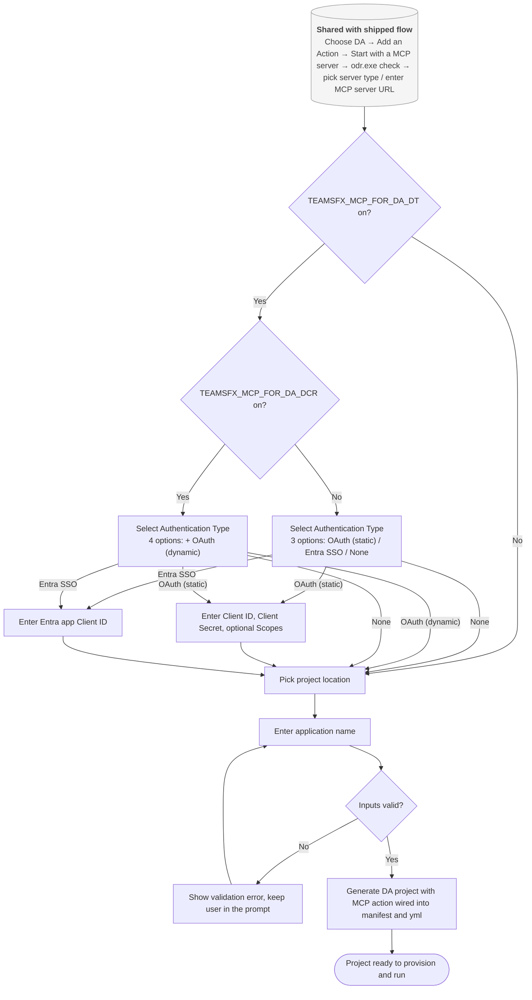
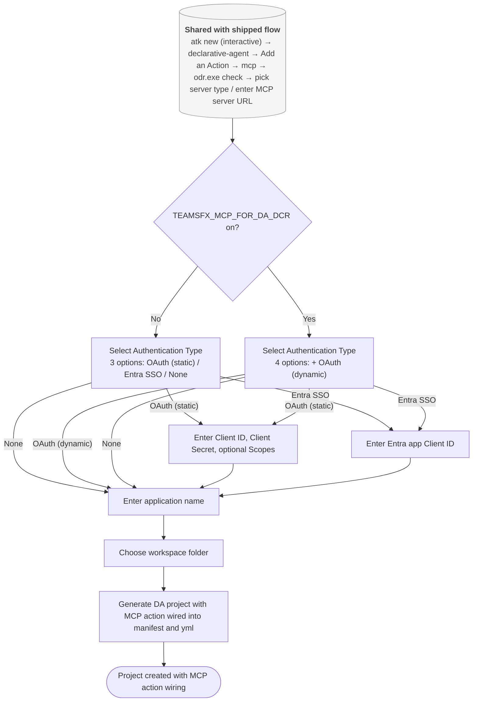
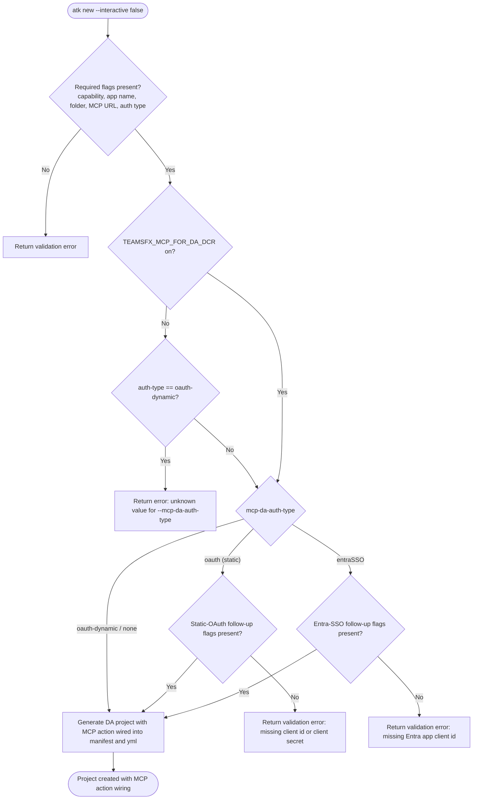
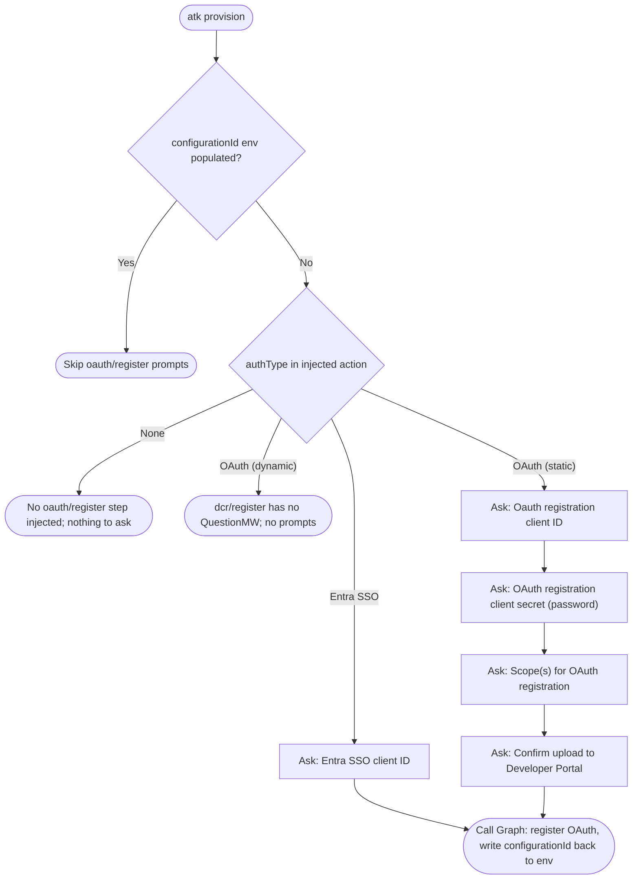

# Create Declarative Agent With MCP Server (draft)

## Metadata

- Created: 2026-05-20T00:00:00Z
- Last updated: 2026-05-20T00:00:00Z
- PM owner: summzhan
- Engineer owner: HuihuiWu-Microsoft, Alive-Fish
- Scenario group: da
- Scenario ID: SCN-DA-CREATE-WITH-MCP-SERVER
- Visual/state reference: create-da-with-mcp-server.html

> **Draft note:** This draft redesigns the live [`../create-da-with-mcp-server.md`](../create-da-with-mcp-server.md). The new flow drops static tool fetching during scaffolding (tools are discovered dynamically at runtime), and folds the authentication setup into the create flow itself. After project generation the developer has a complete, ready-to-provision DA project with the MCP action already wired into the manifest and the `m365agents.yml`. Companion redesign: [`add-mcp-action-to-da.md`](add-mcp-action-to-da.md).

## Scenario

A developer creates a Declarative Agent project that is connected to an MCP server. After answering a short series of questions &mdash; MCP server URL, authentication type, and at most a couple of follow-up fields &mdash; the toolkit generates a project that already contains the MCP-backed action: the action manifest is in place, the declarative agent manifest references it, and `m365agents.yml` has the OAuth provisioning step injected when the authentication type requires it. No static tool list is captured at scaffolding; the agent host discovers the MCP server's tools at runtime.

Success means the developer can choose the Declarative Agent path, choose `Add an Action`, choose `Start with a MCP server`, provide the MCP server URL, pick an authentication type, fill any conditional follow-up fields, name the application, and pick a project location &mdash; and end up with a generated project that is ready to provision and run.

## Dependencies

- Produces: a DA project folder with `appPackage/manifest.json`, a declarative agent manifest referencing the new MCP action, an action manifest (`ai-plugin.json`) wired to the MCP server URL, an `m365agents.yml` whose provisioning steps include the OAuth registration action when the authentication type requires it, and a `.vscode/mcp.json` with an entry for the MCP server URL so the developer can immediately exercise the server from Copilot Chat in VS Code.
- For the `OAuth (with static registration)` authentication type, the project also contains environment files (`env/.env.dev` and `env/.env.dev.user`) populated with placeholders for the developer-provided client id, client secret, and optional scopes.
- Does not include: a static MCP tools JSON file. Tool discovery is deferred to the agent host at runtime.
- Companion redesign: `SCN-DA-ADD-MCP-ACTION-TO-DA` uses the same auth-type question tree for an already-existing DA project.

## Feature flags

Two temporary flags scope incremental rollout of the new behavior on this page; both default **off**.

- `TEAMSFX_MCP_FOR_DA_DT` &mdash; gates the credential-persistence subset of this scenario: the scaffold persists OAuth client id / scope / secret answers under project-standard UPPER_SNAKE names in `env/.env.<env>` and `env/.env.<env>.user`, and the `oauth/register` step in `m365agents.yml` references them via `${{...}}`. MCP-backed DA itself is now unconditionally available in the create flow (the old umbrella flag has been removed).
- `TEAMSFX_MCP_FOR_DA_DCR` &mdash; gates only the `OAuth (with dynamic registration)` auth-type option in step 6 and the matching `dcr/register` action in `m365agents.yml`. The option is shown &mdash; and the CLI value `oauth-dynamic` is accepted &mdash; only when **both** `TEAMSFX_MCP_FOR_DA_DT` and `TEAMSFX_MCP_FOR_DA_DCR` are `true`, because DCR scaffolding currently piggybacks on the DT-mode env-file plumbing.

Both flags are intended to be temporary and removed once the rollout is complete.

## Surfaces

- VS Code: primary guided creation experience using Quick Pick, input box, and notification states.
- CLI interactive: prompt-driven `atk new` behavior. Same questions as VS Code: capability, action source, MCP server URL, authentication type, conditional follow-up fields, app name, and folder.
- CLI non-interactive: flag-driven `atk new` behavior. Requires `--capability declarative-agent`, `--with-plugin yes`, `--api-plugin-type mcp`, `--mcp-da-server-url`, `--mcp-da-auth-type`, `--app-name`, and `--folder`. Conditional follow-up flags are required only when the chosen authentication type asks for them.
- Visual Studio and chat: not covered by this draft scenario.

## States

- Entry: no project choice has been made; the user can choose `Declarative Agent` from the new project flow.
- Template decision: the user picks one of `No Action`, `Add an Action`, `Add a Copilot connector`, or `Start with TypeSpec for Microsoft 365 Copilot`.
- Action source decision: when adding an action, the user picks `Start with a MCP server`.
- MCP source: after `Start with a MCP server`, the toolkit checks whether `odr.exe` is installed on the user's machine. If `odr.exe` is present, the user is asked `MCP Server Type` and chooses `Local MCP server` or `Remote MCP server`. If `odr.exe` is not present, the prompt is skipped and the flow proceeds as `Remote MCP server`. The `Local MCP server` branch only asks the developer to multi-select one or more pre-discovered local servers; it does **not** ask for a server URL, an authentication type, or any auth follow-up fields. CLI non-interactive only supports `--mcp-server-type remote`.
- Server URL input: text input titled `MCP Server URL` with placeholder `Enter your MCP server URL(e.g. https://example-mcp.com)`. Required.
- Authentication type pick: single-select titled `Select Authentication Type` with options shown in this order (the `OAuth (with dynamic registration)` option is only present when both `TEAMSFX_MCP_FOR_DA_DT` and `TEAMSFX_MCP_FOR_DA_DCR` are on):
  - `OAuth (with static registration)` &mdash; follow-up: required `Client ID`, required `Client Secret`, optional `Scopes` (space-separated).
  - `OAuth (with dynamic registration)` &mdash; the MCP server registers a client at runtime; no follow-up fields.
  - `Entra SSO` &mdash; follow-up: required `Client ID` of an Entra application that will be used for provisioning. No tenant id or scopes are asked here.
  - `None` &mdash; no follow-up.

  In **VS Code**, this pick (and all conditional follow-up fields) is gated on `TEAMSFX_MCP_FOR_DA_DT`: when the flag is **off**, the create flow skips the auth-type pick entirely and jumps straight to the project location step &mdash; matching shipped behavior, where auth-type is collected later by the fetch-mcp-tools CodeLens (`SCN-DA-FETCH-MCP-TOOLS`). In **CLI**, the pick is always reachable; non-interactive mode requires `--mcp-da-auth-type`.
- App name and location: standard app-name input and project location picker.
- Generated project (all auth types): the action manifest references the MCP server URL, the declarative agent manifest references the new action, `m365agents.yml` is generated with the standard DA provisioning steps, and `.vscode/mcp.json` contains an entry pointing at the MCP server URL so the developer can call the server from Copilot Chat in VS Code without further setup. When an auth step is injected, the `name:` of the `oauth/register` or `dcr/register` step in `m365agents.yml` matches the `namespace` written into `ai-plugin.json` (derived from the app name via `SafeProjectNameLowerCase`). The `id` of the action inside `declarativeAgent.json` stays at the template default `action_1` and is intentionally not aligned &mdash; it is a local identifier within the manifest, not a provisioning handle.
- Generated project (`OAuth (with static registration)`): in addition, `m365agents.yml` includes an `oauth/register` step, and `env/.env.dev` plus `env/.env.dev.user` contain placeholders for the client id, client secret, and scopes the developer entered. The secret is written into `env/.env.dev.user` and is not committed.
- Generated project (`Entra SSO`): in addition, `m365agents.yml` references the developer-provided Entra application client id for the SSO action.
- Generated project (`OAuth (with dynamic registration)`): in addition, `m365agents.yml` includes a `dcr/register` step (RFC 7591 Dynamic Client Registration). The scaffold probes the MCP server (HTTP `POST` of an MCP `initialize` JSON-RPC body) to auto-discover the well-known authorization-server URL via the `WWW-Authenticate` `resource_metadata` chain. The `m365agents.yml` schema `version:` is bumped from the template default `v1.12` to `v1.13` on `dcr/register` injection, because the DCR action requires schema v1.13+.
- Recoverable warning (`OAuth (with dynamic registration)`): when auto-discovery of the well-known URL fails, `dcr/register` is still injected, but `wellKnownAuthorizationServer` is set to the literal placeholder `<PLEASE_FILL_IN_WELL_KNOWN_AUTHORIZATION_SERVER_URL>` and a warning notification is surfaced. The developer must replace the placeholder before provisioning.
- Recoverable error: invalid app name, invalid or unavailable location, invalid MCP server URL, missing required auth follow-up field (static OAuth client id/secret, Entra SSO client id), or missing required non-interactive option is shown with a same-flow recovery path.
- Cancellation: the user can cancel before project generation; cancellation must not create a partially accepted project.

## Flow

### VS Code create flow

Focus: the **auth-type pick and its DT / DCR gating** are what this scenario changes; the steps before “enter MCP server URL” are unchanged from the shipped flow and collapsed into a single shared-preamble node.



> Any step before `Generate` may be cancelled; cancellation must not leave a partially scaffolded project on disk.

### CLI interactive create flow

Focus: the auth-type pick is always reachable in CLI (no DT gate); only the **option set** is gated by DCR.



> Any step before `Generate` may be cancelled.

### CLI non-interactive create flow

Focus: how the DCR flag affects validation of `--mcp-da-auth-type oauth-dynamic`. Generic required-flag and follow-up-flag checks are collapsed.



Example non-interactive command (no auth):

```bash
atk new -c declarative-agent --with-plugin yes --api-plugin-type mcp --mcp-server-type remote \
  --mcp-da-server-url <server-url> --mcp-da-auth-type none \
  -n <app-name> -f <folder> --interactive false
```

Example non-interactive command (static OAuth):

```bash
atk new -c declarative-agent --with-plugin yes --api-plugin-type mcp --mcp-server-type remote \
  --mcp-da-server-url <server-url> --mcp-da-auth-type oauth \
  --mcp-da-client-id <client-id> --mcp-da-client-secret <client-secret> --mcp-da-scopes "<space-separated-scopes>" \
  -n <app-name> -f <folder> --interactive false
```

Example non-interactive command (Entra SSO):

```bash
atk new -c declarative-agent --with-plugin yes --api-plugin-type mcp --mcp-server-type remote \
  --mcp-da-server-url <server-url> --mcp-da-auth-type entraSSO \
  --mcp-da-entra-client-id <entra-app-client-id> \
  -n <app-name> -f <folder> --interactive false
```

Example non-interactive command (dynamic OAuth):

> **Requires** both `TEAMSFX_MCP_FOR_DA_DT=true` and `TEAMSFX_MCP_FOR_DA_DCR=true`. With either flag off, `--mcp-da-auth-type oauth-dynamic` is rejected during flag validation.

```bash
atk new -c declarative-agent --with-plugin yes --api-plugin-type mcp --mcp-server-type remote \
  --mcp-da-server-url <server-url> --mcp-da-auth-type oauth-dynamic \
  -n <app-name> -f <folder> --interactive false
```

## Provision-time prompts (oauth/register)

Source of truth verified in code:
- `oauth/register` driver: [`packages/fx-core/src/component/driver/oauth/create.ts`](../../../../packages/fx-core/src/component/driver/oauth/create.ts) &mdash; registers `QuestionMW("oauth", true)`.
- Question tree: `oauthQuestion()` in [`packages/fx-core/src/question/other.ts`](../../../../packages/fx-core/src/question/other.ts).
- Injection payload: `ActionInjector.injectCreateOAuthActionForMCP` in [`packages/fx-core/src/component/configManager/actionInjector.ts`](../../../../packages/fx-core/src/component/configManager/actionInjector.ts).
- DCR driver: [`packages/fx-core/src/component/driver/dcr/create.ts`](../../../../packages/fx-core/src/component/driver/dcr/create.ts) &mdash; **no `QuestionMW`**.

### Idempotency gate (applies to all auth types)

The entire question group is skipped when `process.env[<configurationId>]` is already populated. For this scenario the configurationId env var is `MCP_DA_AUTH_ID_<SERVERNAME>` (e.g. `MCP_DA_AUTH_ID_APIGITHUBC`). Re-provisioning into the same environment therefore asks **nothing**.

### What the injected `with:` block contains per auth type

| Auth type | `identityProvider` | Fields written by `injectCreateOAuthActionForMCP` | Fields **not** written (filled at provision) |
|---|---|---|---|
| OAuth (static) | `Custom` | `name`, `appId`, `flow: authorizationCode`, `baseUrl`, `authorizationUrl`, `tokenUrl`, `refreshUrl?` | `clientId`, `clientSecret`, `scope` |
| Entra SSO | `MicrosoftEntra` | `name`, `appId`, `flow: authorizationCode`, `baseUrl` | `clientId` |
| OAuth (dynamic) | n/a (uses `dcr/register`) | full DCR payload baked in | &mdash; (no prompts) |
| None | n/a (no step injected) | &mdash; | &mdash; (no prompts) |

### Prompts asked when the configurationId env var is empty

| # | Prompt (English title) | Kind | OAuth (static) | Entra SSO | OAuth (dynamic) | None |
|---|---|---|:-:|:-:|:-:|:-:|
| 1 | `Oauth registration client ID` | text | ✅ | — | — | — |
| 1' | `Entra SSO client ID` | text | — | ✅ | — | — |
| 2 | `OAuth registration client secret` | password | ✅ | — | — | — |
| 3 | `Scope(s) for OAuth registration` | text | ✅ | — | — | — |
| 4 | Confirm upload to Developer Portal | confirm | ✅ | — | — | — |

Notes:
- The skipping logic comes from per-child `condition` callbacks in `oauthQuestion()`. Entra SSO suppresses the client secret (`identityProvider === "Custom"` is required) and the scope (`identityProvider === "Custom"` is required) and the confirm (same predicate). PKCE (`isPKCEEnabled`) is not used by the MCP path and therefore behaves as `false`.
- Each prompt is also pre-empted by `process.env["oauth-client-id"]` / `process.env["oauth-client-secret"]` / `process.env["oauth-scope"]` &mdash; `execute()` reads those env vars into the args before calling `validateArgs`. The dash-cased names are intentional and match `QuestionNames.OauthClientId` etc.
- The scaffolder does **not** &mdash; and must not &mdash; call the Developer Portal API to create the OAuth configuration; configuration creation belongs to provision (`oauth/register`). `CreateOauthArgs` already declares `clientId`, `clientSecret`, `scope` as first-class fields, so the clean design is: scaffold persists the answers under project-standard UPPER_SNAKE env names, and `actionInjector` writes explicit `${{...}}` references into the `oauth/register` step.

  **Static OAuth** &mdash;
  - `env/.env.dev`: `MCP_DA_OAUTH_CLIENT_ID_<SERVERNAME>=...`, `MCP_DA_OAUTH_SCOPE_<SERVERNAME>=...` (plus the existing `MCP_DA_AUTH_ID_<SERVERNAME>=` placeholder).
  - `env/.env.dev.user` (gitignored, auto-masked): `SECRET_MCP_DA_OAUTH_CLIENT_SECRET_<SERVERNAME>=...`.
  - `m365agents.yml`: `actionInjector` adds `clientId: ${{MCP_DA_OAUTH_CLIENT_ID_<SERVERNAME>}}`, `clientSecret: ${{SECRET_MCP_DA_OAUTH_CLIENT_SECRET_<SERVERNAME>}}`, `scope: ${{MCP_DA_OAUTH_SCOPE_<SERVERNAME>}}` to the `with:` block alongside `name`/`appId`/`flow`/`identityProvider: Custom`/`baseUrl`/`authorizationUrl`/`tokenUrl`/`writeToEnvironmentFile.configurationId`.

  **Entra SSO** &mdash; only `clientId` is required (driver suppresses secret/scope/confirm when `identityProvider === MicrosoftEntra`).
  - `env/.env.dev`: `MCP_DA_OAUTH_CLIENT_ID_<SERVERNAME>=...` (+ existing `MCP_DA_AUTH_ID_<SERVERNAME>=`).
  - `m365agents.yml`: `actionInjector` adds `clientId: ${{MCP_DA_OAUTH_CLIENT_ID_<SERVERNAME>}}` to the `with:` block.

  **Today** `actionInjector` omits all three fields and the driver falls back to dash-cased `process.env["oauth-client-id"]` / `oauth-client-secret` / `oauth-scope`, which is an in-process bridge populated by the create-flow `QuestionMW`. Once env-file persistence is in place and YAML references the UPPER_SNAKE names, that fallback in [`packages/fx-core/src/component/driver/oauth/create.ts`](../../../../packages/fx-core/src/component/driver/oauth/create.ts) becomes legacy and provision asks zero questions on first run.



## Validation notes

- VS Code UI test intent should trace to `SCN-DA-CREATE-WITH-MCP-SERVER` and cover the new auth-type pick and each conditional follow-up path. The success state is a generated project whose manifest, action manifest, and yml all reference the MCP action; static-OAuth additionally verifies env file placeholders.
- CLI E2E test intent should trace to `SCN-DA-CREATE-WITH-MCP-SERVER` for interactive and non-interactive `atk new` paths and cover each auth-type value (`oauth-dynamic`, `oauth`, `entraSSO`, `none`).
- CLI non-interactive validation should cover missing `--mcp-da-server-url`, missing `--mcp-da-auth-type`, missing static-OAuth follow-up flags (`--mcp-da-client-id`, `--mcp-da-client-secret`), missing Entra-SSO `--mcp-da-entra-client-id`, invalid app name, and invalid or unavailable target folder.
- The static MCP tools file flag (`--mcp-tools-file-path`) and the static "Select Operation(s) Copilot can interact with" pick are explicitly out of scope for this scenario in the new flow; tool discovery is dynamic at runtime.
