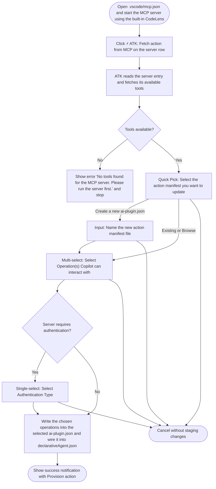

# Fetch Tools From MCP Server

## Metadata

- Created: 2026-05-20T00:00:00Z
- Last updated: 2026-05-20T00:00:00Z
- PM owner: summzhan
- Engineer owner: HuihuiWu-Microsoft, Alive-Fish
- Scenario group: da
- Scenario ID: SCN-DA-FETCH-MCP-TOOLS
- Visual/state reference: fetch-mcp-tools.html

## Scenario

A developer has a Declarative Agent project with `.vscode/mcp.json` containing at least one MCP server entry (typically produced by `SCN-DA-CREATE-WITH-MCP-SERVER` or `SCN-DA-ADD-MCP-ACTION-TO-DA`). They start the MCP server with the built-in VS Code MCP `Start` CodeLens, then click `⚡ ATK: Fetch action from MCP`. That single CodeLens click runs the entire flow end-to-end: ATK discovers tools from the running server, prompts the user to pick (or create) an action manifest, optionally asks for a new file name, lets the user pick which operations Copilot can interact with, asks for an authentication type when the server requires it, and finally writes the operations into the chosen `ai-plugin.json` and wires it into `declarativeAgent.json`. The toolkit then shows the success notification with a `Provision` action.

Success means: a single MCP server is resolved from `.vscode/mcp.json`; a non-empty tool list is materialized; the user's manifest, operation and auth choices are captured; and `ai-plugin.json` + `declarativeAgent.json` are updated. This scenario owns every interactive step that the CodeLens click triggers, including the success state.

## Dependencies

- Requires: an existing DA project with `appPackage/manifest.json`, a declarative agent manifest, and `.vscode/mcp.json` containing at least one MCP server entry. `SCN-DA-CREATE-WITH-MCP-SERVER` and `SCN-DA-ADD-MCP-ACTION-TO-DA` are the two scenarios that produce this state.
- The MCP server entry must be reachable: for a remote (`http`) server, VS Code must be able to start and contact it; for a local (`stdio`) server, the command and any required runtime (for example `odr.exe`) must be installed on the user's machine. The toolkit cannot run this scenario before the server is reported as running by the built-in CodeLens.
- Produces: an updated action manifest (existing `ai-plugin.json` or a newly created one) and an updated `declarativeAgent.json` with the new action wired in. When the chosen server requires authentication, the toolkit also writes the OAuth registration follow-up actions so provisioning can complete.

## Surfaces

- VS Code built-in CodeLens: VS Code's MCP runtime owns the `Start`, `tools`, `prompts`, and `More...` actions on each server entry in `.vscode/mcp.json`. Pressing `Start` brings the server up and populates the tools/prompts counts shown next to the server.
- VS Code ATK CodeLens: ATK contributes `⚡ ATK: Fetch action from MCP` on each server key. The CodeLens is the primary entry point for this scenario; because it is per-server, the click already binds the action to that specific server and no server picker is shown.
- VS Code Command Palette (edge case): `ATK: Update Action with MCP` is also available without a click target; in that case the toolkit reads `.vscode/mcp.json` and, only if more than one server is configured, prompts the user to pick one in a Quick Pick titled `Select MCP Server`. This Command Palette path is not part of the primary visualized flow.
- CLI: not covered by this scenario. The CLI uses an end-to-end `atk add action --api-plugin-type mcp` path described in `SCN-DA-ADD-MCP-ACTION-TO-DA` which combines URL collection with tool fetch and action manifest update; it does not have a separate fetch surface.
- Visual Studio and chat: not covered.

## States

- Entry: `.vscode/mcp.json` is open in VS Code; the built-in MCP CodeLens row is visible. The server entry was placed there earlier by `SCN-DA-CREATE-WITH-MCP-SERVER` or `SCN-DA-ADD-MCP-ACTION-TO-DA`.
- Built-in CodeLens row: `Start | tools | prompts | More...`. Before the server starts, the tools and prompts counts are not shown. After start, the counts reflect what VS Code's MCP runtime discovered.
- ATK CodeLens row: `⚡ ATK: Fetch action from MCP`. Also reachable from the Command Palette as `ATK: Update Action with MCP`.
- Server resolution: each ATK CodeLens is rendered per server entry, so a CodeLens click already binds the action to that server and no server picker is shown. The multi-server `Select MCP Server` Quick Pick is reached only from the Command Palette when `.vscode/mcp.json` contains more than one server; each row shows either the server URL (for `http` servers) or `command args` (for `stdio` servers) as its description.
- Tool discovery: after the click, the toolkit reads the tools from the running MCP server. The user does not see a separate prompt for this step; the flow either advances to manifest selection or surfaces the empty-tools error described below.
- Manifest selection: ATK shows a Quick Pick titled `Select the action manifest you want to update`. The list contains the action manifest files already wired into the declarative agent, a `Create a new ai-plugin.json` row, and the `Browse…` row.
- Name new manifest: when the user picks `Create a new ai-plugin.json`, ATK shows the text input `Name the new action manifest file` with default `ai-plugin.json`. Validation rejects empty input, names without the `.json` extension, absolute or nested paths, and names that already exist in `appPackage/`.
- Operation selection: the Quick Pick titled `Select Operation(s) Copilot can interact with` lists the operations the toolkit fetched from the server. When the user is updating a manifest that already references this MCP server, the operations already wired in are pre-selected.
- Auth type selection: when the MCP server requires authentication, the Quick Pick titled `Select Authentication Type` is shown with `OAuth (with static registration)` and `Entra SSO` options. Unauthenticated servers skip this step.
- Success: ATK shows `The operations selected from your MCP server are successfully added for Copilot to interact with. You can go to the 'ai-plugin.json' to check on details. Now you are able to provision your declarative agent to continue.` with `Provision` as the action.
- Recoverable: tools not found. When the server returns no tools, ATK shows the error notification `No tools found for the MCP server. Please run the server first.` (source: Microsoft 365 Agents Toolkit) and the flow stops before the manifest picker appears. The user starts the server (or fixes the tools file) and re-clicks `⚡ ATK: Fetch action from MCP`.
- Recoverable: prerequisites missing. When `.vscode/mcp.json` is missing, malformed, has no servers, or the selected server entry is incomplete (no URL for an `http` server, no command for a `stdio` server), ATK shows an error notification describing the missing piece and stops before any picker opens. The user fixes the file and retries.
- Cancellation: the user can cancel at any picker (manifest selection, name new manifest input, operation multi-select, auth single-select, or the rare Command Palette multi-server picker) before the manifest is updated; cancellation must not leave behind a partial selection or write to disk.

## Flow

### VS Code fetch tools flow

## User-visible outputs

This scenario updates an existing DA project; there is no template boilerplate to summarize. Every output listed below is driven by the user's answers in the picker flow (manifest pick, optional new-manifest name, operation multi-select, optional auth type pick).

### File changes

- `appPackage/<chosen action manifest>.json` (default `ai-plugin.json`) — created when the user picks `Create a new ai-plugin.json` (file name from the `Name the new action manifest file` input), modified otherwise. The operations selected in `Select Operation(s) Copilot can interact with` are written under `functions` and referenced from the MCP server runtime's `run_for_functions`. When the server requires authentication, the runtime's `auth` block is written to point at the OAuth configuration injected into `m365agents.yml`. When the user is updating a manifest that already references this MCP server, existing operations remain in place; only added/removed operations from the multi-select change the file.
- `appPackage/declarativeAgent.json` — modified only when a new action manifest was created in step 3. A new entry is appended to `actions` with an `id` that does not collide with existing actions (`action`, `action_2`, ...) and `file` set to the new manifest's basename. When an existing action manifest is reused, this file is not touched.
- `m365agents.yml` — modified only when the user selected an authentication type for this MCP server runtime and the matching registration step is not already present. The toolkit injects the OAuth registration follow-up step at the same shape and ordering used by `SCN-DA-CREATE-WITH-MCP-SERVER` and `SCN-DA-ADD-MCP-ACTION-TO-DA`, so the manifest's `auth.reference_id` resolves at provision time.

### Notifications

- Success (info, source `Microsoft 365 Agents Toolkit`): title `MCP action added`, message `The operations selected from your MCP server are successfully added for Copilot to interact with.`, detail `You can go to the 'ai-plugin.json' to check on details. Now you are able to provision your declarative agent to continue.`, action button `Provision` (runs the standard provision lifecycle).

### Error and recovery messages

- `No tools found for the MCP server. Please run the server first.` — error toast (source `Microsoft 365 Agents Toolkit`). Surfaced when the MCP server returns no tools at discovery time. Recovery: start the server using the built-in VS Code MCP `Start` CodeLens (or fix its configuration) and re-click `⚡ ATK: Fetch action from MCP`. No files are written before this fires.
- Prerequisite errors — error toasts surfaced when `.vscode/mcp.json` is missing, malformed, has no server entries, or the resolved server entry is incomplete (no `url` for an `http` server, no `command` for a `stdio` server). Each toast names the missing piece. Recovery: edit `.vscode/mcp.json` and retry the CodeLens. No files are written before these fire.
- Cancellation at any picker (manifest selection, name new manifest input, operation multi-select, auth single-select, or the rare Command Palette `Select MCP Server` multi-server picker) leaves no notification and writes nothing to disk.

### Environment and secret writes

- The injected OAuth registration step in `m365agents.yml` reserves a configuration id that is written into the project's environment files when the provision lifecycle runs. The scenario itself does not write to `env/.env.*` at picker time; auth secret collection in VS Code follows the same convention as `SCN-DA-CREATE-WITH-MCP-SERVER` and `SCN-DA-ADD-MCP-ACTION-TO-DA` and is deferred to those scenarios.

### External side effects

- None at scenario time. Any cloud-side OAuth client registration happens later during the provision lifecycle, when the injected `oauth/register` (or `dcr/register`) step runs.

## Validation notes

- VS Code UI test intent should trace to `SCN-DA-FETCH-MCP-TOOLS` and cover both entry points (`⚡ ATK: Fetch action from MCP` CodeLens and `ATK: Update Action with MCP` Command Palette), single-server vs multi-server resolution, both remote (`http`) and local (`stdio`) MCP servers, manifest selection (existing vs `Create a new ai-plugin.json` vs `Browse…`), the `Name the new action manifest file` input and its validation rules, operation pre-selection when updating an existing manifest, the conditional `Select Authentication Type` step, and the `Provision` success notification.
- Recovery validation should exercise the empty-tools error notification `No tools found for the MCP server. Please run the server first.` and the prerequisite errors raised when `.vscode/mcp.json` is missing, malformed, has no server entries, or the resolved entry is missing its URL (for `http`) or command (for `stdio`). The flow should not write to `ai-plugin.json` or `declarativeAgent.json` when any of these errors fire.
- This scenario is the VS Code post-step for `SCN-DA-ADD-MCP-ACTION-TO-DA`; any test that exercises the end-to-end add-action UX in VS Code should treat the CodeLens click and everything after it as covered by this scenario.
- Future spec acceptance criteria should trace to the related PRD requirement IDs once the dedicated PRD exists.
