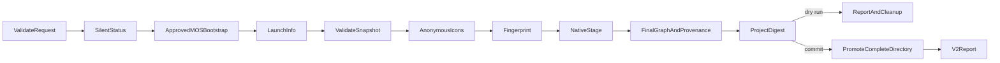

# Import a returned launch-info agent snapshot

**Status:** Approved implementation contract (September 14, 2026).
**Domain:** Scaffolding / authenticated source acquisition.
**Profile:** `agent-title/1`. **Report version:** 2.

The approved requirement extends the existing package-graduation workflow with
an explicit Title ID. The source is the **returned launch-info snapshot**, not
an original ZIP, an authoring draft, or a revision-identical Developer Portal
export. This approval supplies the product/scenario behavior; no additional UI
or product-design exploration is required. The
[scenario](../../scenarios/agent-package/import-from-title.md) is the workflow
contract. Local [package import](import-agent-package.md) remains unchanged.

## Public contract

`AgentTitleImportRequest` in `@microsoft/teamsfx-api` contains `titleId: string`,
`outputPath?: string`, and `dryRun?: boolean`. `IFxCoreClient`, `FxCoreClient`,
and `FxCore` expose `importAgentFromTitle(request, options?)`, returning
`Promise<Result<AgentTitleImportReport, FxError>>`; execution options contain
`signal?: AbortSignal`.

The new flat report retains all common `AgentMigrationReport` fields but has
`reportVersion: 2` and
`source: {kind: "title-id", titleId: normalizedTitleId, digest: snapshotDigest}`.
It has a separate exported `agentTitleImportReportSchema`; the closed version-1
schema and local import/edit method signatures do not change.

The CLI accepts exactly one of `--source` and `--title-id`:

```powershell
atk import agent --title-id SyntheticTitle-001 --output new-agent --format json -i false
```

The existing JSON success/error envelope is retained. Authentication-required
exits 2, cancellation exits 130, other failures exit 1, and success/help exits 0.
`--dry-run` allows explicit read-only acquisition and complete staging validation,
but leaves no project. It does not imply an offline operation.

### Identity and input normalization

Trim surrounding spaces, then accept a bounded identifier consisting of ASCII
letters, digits, underscores, and hyphens, without assuming a service prefix.
An optional single `.<logical-agent-id>` suffix is removed only provisionally:
the returned unique DA `id` must equal it before any project can be generated.
More than one dot or ambiguous/mismatching suffix is rejected. Base IDs are at
most 256 characters; suffixes at most 128. Blank, control, path, percent-encoded,
query, fragment, credential, and URL inputs are rejected before authentication.

The exact destination defaults to `<normalized-title-id>-imported` under CWD.
Unsafe/overlong defaults require an explicit valid output. Validate request
types, destination nonexistence, safe ancestors, and derived names before asking
the token provider. Never change CWD, merge an existing directory, or authenticate
to repair an invalid local path.

## Supported response profile

The root is JSON with `elementDefinitions.declarativeCopilots` containing exactly
one DA object. Recognized root metadata includes `name`, `shortDescription`,
`developerName`, `version`, `manifestVersion`, `accentColor`, `validDomains`,
`cultureName`, `iconLarge.uri`, and optional `iconSmall.uri`. Other root metadata
is part of the fingerprint, not silently treated as original app-manifest data.
No `acquisition` property is required or synthesized.

The DA must include supported `version`, `name`, `description`, and nonempty
`instructions`; a supplied `id` remains a logical agent ID. Preserve every
schema-supported DA field, exact text, starter order/count, capabilities,
scope forms, and external resource identities. The exact schema alias
`https://aka.ms/json-schemas/copilot/declarative-agent/<version>/schema.json`
is normalized locally to the corresponding bundled canonical schema URL and
reported as a structural transformation. No schema is downloaded or upgraded.
The observed launch-info v1.0 dialect returns CRLF instruction text, although
the bundled v1.0 regex only lists LF. For this source profile, validation adds
CRLF to that exact instruction pattern, retaining its other restrictions and
all original length/type/field constraints. Instruction bytes and the declared
version are unchanged. The compatibility rule is reported explicitly and also
applies when editing/packaging projects identified by historical Title provenance.
It does not relax ordinary local-v1 import validation or alter bundled schemas.

Nonempty unknown element groups, blocked snapshots, multiple agents, unsupported
fields/versions, and unsupported runtime shapes fail. Local actions, workers,
embedded documents, localization references, or
other advertised local dependencies without bytes fail with local-ZIP
remediation. External knowledge/worker/resource IDs retain the existing
by-reference behavior; cloning does not grant access or duplicate those resources.
Instructions in this service profile are literal snapshot text, never evaluated
as source file directives.

### Generated scaffold versus preserved snapshot

Use the existing pinned native profile for the container, lifecycle, environment,
and default outline icon. Preserve available root descriptive metadata only in
corresponding valid container fields. Legal/developer URLs and other absent
container fields remain **generated template defaults**, explicitly identified
by transformations, warnings, and configuration requirements needing review.
Never report these as preserved original metadata. Do not truncate source text
to fit a schema.

`iconLarge.uri` is required and supplies the exact 192x192 color PNG bytes.
If `iconSmall.uri` is advertised, retrieve and validate its preview PNG too,
include its bytes in the source fingerprint, and report it as a skipped preview
asset. It is **not** the outline icon. Both advertised acquisition failures are
fatal. Content validity is determined from PNG bytes/checksums, not a misleading
Content-Type parameter.

The output DA uses the native profile's declared filename and an explicit
container pointer. Its logical `id`, when supplied, is preserved; only the new
container binding becomes `${{TEAMS_APP_ID}}`. No source deployment identity is
invented from `ingestionId`, title ID, or a generated container ID.

## Authentication and network boundary

Use the current host's injected M365 provider with
`getStatus({scopes: MosServiceScope(), showDialog: false})`; require an existing
signed-in result with a token. Never call interactive `getAccessToken`, browser/
device login, logout, tenant switch, account/password fallback, or consent flows.
The CLI binds only the native cached-account status path, not the provider
wrapper that can select password authentication. Its explicit silent status
path must not fall back to login, clear the cache, or perform connectivity probes.

Use the configured-cloud native MOS3 origin for `/config/v1/environment`, then
accept `titlesServiceUrl` only at that same approved HTTPS origin with no
credentials, query, or fragment. GET the normalized Title ID as one encoded path
segment from `/catalog/v1/users/titles/<id>/launchInfo` with the same native
element filter as `getLaunchInfoByTitleId`, including unsupported element kinds
so nonempty groups are detected rather than hidden. No TDP/Graph/list/acquire/publish
fallback exists. Do not use the legacy launch-info logger, which prints payloads.

Anonymous icon GETs are limited to the exact origins
`https://res.cdn.office.net` and `https://store-images.s-microsoft.com`.
No bearer/cookie/account headers, URL credentials, query strings, fragments,
unapproved origins, private/IP hosts, or data URIs are allowed in this profile.
All HTTP redirects are refused. Capability, runtime, knowledge, schema, and
other payload URLs are never fetched.

| Bound | Limit |
|---|---:|
| Whole acquisition, including token wait | 60 seconds |
| Each HTTP request | 15 seconds |
| Bootstrap JSON | 64 KiB |
| Launch-info JSON | 1 MiB |
| Each downloaded icon | 1 MiB |
| Source JSON nesting | 32 levels |
| Downloaded source assets | 2 |

Enforce declared and actual response byte limits, propagate cancellation across
all waits, and distinguish deadline expiry from caller cancellation. Do not log
response bodies, credentials, or source URLs. Transport failures retain useful
stable localized error codes without leaking their request objects.

## Fingerprint and provenance

The source fingerprint uses the existing `artifactDigest` framing on an in-memory
map containing:

- `launchinfo.json`: recursively key-sorted `JSON.stringify` of the complete
  parsed response plus LF; array order, scalar values, and instruction text
  are unchanged.
- `assets/icon-large.png`: exact downloaded source color bytes.
- `assets/icon-small.png`: exact downloaded preview bytes, only if advertised.

This is a snapshot-content fingerprint, not a raw HTTP/ZIP byte digest. Generated
outline/container/lifecycle bytes are not source assets. Do not persist the raw
response, account/token objects, or credentialed URLs.

Reuse the existing import staging/promotion boundary. Before final project
snapshot/digest, write `.atk/import.json` with `reportVersion: 2`,
`ruleVersion: "agent-package/1"`, `source`, `sourceDigest`, `identity`,
`sourceAgents`, and `template`. `source` is the same three-field title descriptor
as the report; `sourceAgents` is empty because this profile's DA IDs are logical,
not inferred deployment IDs. The rest uses the shared native provenance model.
No provenance write occurs after promotion. Version-1 edits preserve this
historical provenance and continue returning version-1 edit reports.

## Errors

`AgentTitleSourceInvalid`: invalid request/response shape or identifier.
`AgentTitleSourceUnsupported`: unsupported profile, element group, or schema.
`AgentTitleSourceIncomplete`: missing required definition, advertised asset, or
local dependency bytes. `AgentTitleAuthenticationRequired`: no usable silent
signed-in status/token. `AgentTitleRequestFailed`: HTTP, transport, or timeout.
Existing `UserCancel` and local destination/filesystem errors are retained.
Title errors include a stable, non-sensitive reason code when the failure
branch can be identified; no source text, title, credential, or URI is embedded.
Malformed/oversized advertised PNGs are incomplete-source errors, never replaced
with default color branding.

## Acceptance Criteria

| ID | Runtime | Purpose | Gate | Harness | Given / when | Then |
|---|---|---|---|---|---|---|
| TTI-01 | L1 | operation-integration | required | Synthetic HTTP + real generator | Observed one-primary-DA snapshot is imported | Native complete new project; v2 report; current DA/root metadata preserved |
| TTI-02 | L1 | compatibility | required | Shared resolver + real PNGs | Literal Unicode/BOM/CRLF/template-like instructions, starters/scopes/IDs and preview icon | Exact DA behavior/color preserved; generated outline distinguished from preview |
| TTI-03 | L1 | operation-integration | required | Native staged import | Missing original container/legal fields | Generated scaffolding truthfully reported and review-required; no source identity takeover |
| TTI-04 | L1 | operation-integration | required | Path/provider harness | Invalid IDs/suffixes/destination/links/types or existing target | Fail closed; invalid local inputs invoke no token/network calls |
| TTI-05 | L1 | operation-integration | required | Silent provider + bounded wait | Signed out/error/hung status, expired deadline, caller cancellation | Stable auth/timeout/cancel errors; no interactive/auth-state changes |
| TTI-06 | L1 | operation-integration | required | Real HTTP client with fake edge | Unapproved bootstrap/CDN, redirects, credentialed URLs, bytes/timeout limits | Reject unsafe transport; MOS bearer never reaches icons or arbitrary URLs |
| TTI-07 | L1 | operation-integration | required | Synthetic response corpus | Missing/multiple DA, nonempty element groups, missing local actions/workers/knowledge, alias/unknown schema | Explicit invalid/unsupported/incomplete errors, no lossy reconstruction |
| TTI-08 | L1 | operation-integration | required | Real filesystem + fault seam | Dry run, cancellation, malformed/unreachable PNG, staging/promotion failure | No partial destination or residual owned staging; source immutable |
| TTI-09 | L1 | scenario | required | Public import/edit/package | Import, approved edit/no-op, local native packaging | Exact packaged text/assets, new identity, complete-state digest and historical title provenance |
| TTI-10 | L2 | surface | required | CLI command/process harness | --source versus --title-id, help/JSON/error/auth/cancellation | Exclusive sources, proper envelope/exits, silent auth, old local offline behavior intact |
| TTI-11 | L1 | compatibility | required | Built package resolution | Public exports/schema/profile assets and original local suites | Additive v2 capability ships; v1 API/schema/digests remain unchanged |

## Flow



## Boundary

No original-ZIP/revision claims, tenant discovery, TDP/Graph acquisition, account
changes, consent, source execution, AI, source updates, install/acquire, provision,
share, publish, or unapproved fallback reconstruction. Only synthetic fixtures
are committed; privately inspected agents/assets are not redistributed.

## Invariants

The original agent remains untouched. Available source behavior is preserved;
unavailable required content fails explicitly. Generated fields are never
misrepresented as source-preserved. No bearer reaches an anonymous asset URL.
Local import/edit v1 remains byte-compatible. Promotion and provenance share one
staging transaction; errors never become successful partial reports.
