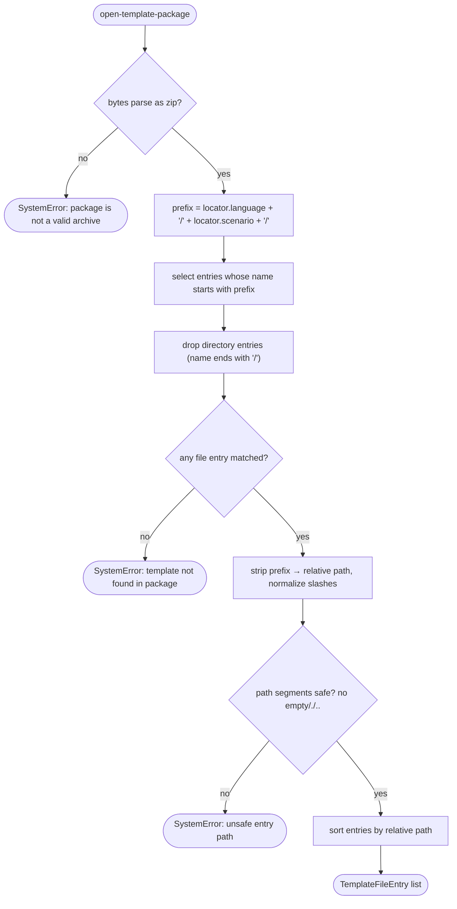

# Operation — `open-template-package`

- **Status:** Accepted (Gate 1 + Gate 2 cleared 2026-06-03) — ready for tests
- **Domain:** [`01-scaffolding`](../../domains/01-scaffolding.md)
- **Decision source:** [ADR-0006](../../../02-architecture/adr/ADR-0006-template-distribution-channel.md),
  [`scaffolding.create.proposal.md` §3](../../../02-architecture/scaffolding.create.proposal.md)
- **Upstream operation:** [`resolve-template-source`](resolve-template-source.md)
  (produces the package bytes this operation opens)
- **PRD/scenario:** none required — internal, behavior-preserving package
  consumption with no user-visible surface change.

## Purpose

Given the resolved template-package **bytes** and a **locator**, open the
package and return the file entries of exactly one template, with the
locator's path prefix stripped so each entry is rooted at the template's
content. This is the single step between
[`resolve-template-source`](resolve-template-source.md) (which decides *which
bytes*) and the renderer (which decides *what the rendered project looks
like*): it decides *what is inside the package and where the chosen template
lives*.

`resolve-template-source`'s boundary explicitly defers in-package layout —
"In-package layout (per-template descriptor dirs, language dirs) is the
consumer's concern." This operation is that consumer.

## Stable boundary, evolvable locator

The **boundary** — open archive → locate one template subtree → hand back
file entries — is permanent. `resolve-template-source` yields bytes; some
operation must always turn bytes into renderable entries, regardless of the
package's internal layout. The v4 scaffolding engine builds *on top of* this
operation; it does not remove it.

The **locator shape** is transitional. The package in production today carries
the v3 content mirrored under `<language>/<scenario>/…`, so the locator is
`{ language, scenario }`. When the [`§3`](../../../02-architecture/scaffolding.create.proposal.md)
`<templateId>/{descriptor,questions,pipeline,content}` authoring layout ships,
the locator becomes `{ templateId }`. That change swaps only the **prefix the
locator resolves to** — `openPackage`, the entry contract, and every AC below
hold unchanged (INV-1). The locator is therefore a neutral structure, never a
焊死 `{language, scenario}` assumption baked into the open/entry contract.

## Inputs

| Input | Type | Origin |
|-------|------|--------|
| `bytes` | `Buffer` | the resolved package bytes from [`resolve-template-source`](resolve-template-source.md) (`port.packages` / cache / floor) |
| `locator` | `TemplateLocator` (`{ language: string; scenario: string }`) | the engine's routing decision (Q1 selector → which template) |

This operation does **not** depend on the full `ScaffoldRuntime`. It is a pure
function of `(bytes, locator)` (INV-5): no `fs`, no `http`, no `clock`.

## Outputs

A `Result<TemplateFileEntry[], FxError>`. Each entry:

| Field | Meaning |
|-------|---------|
| `path` | the file path **relative to the located template's content root** (the `<language>/<scenario>/` prefix stripped), forward-slash normalized |
| `data` | the file's raw bytes, **verbatim** — unrendered, `.tpl` suffix intact |

The entry list is the renderer's input. This operation never renders, writes,
or interprets the bytes.

## Acceptance Criteria

| ID | Tier | Given | When | Then |
|----|------|-------|------|------|
| AC-01 | L1 | a valid zip with files under `common/da-basic/` and a locator `{language:"common", scenario:"da-basic"}` | open | returns every file under `common/da-basic/` with the `common/da-basic/` prefix stripped; paths rooted at the template content |
| AC-02 | L1 | a located subtree containing nested folders (e.g. `common/da-basic/appPackage/manifest.json.tpl`) | open | the nested relative path `appPackage/manifest.json.tpl` is preserved and forward-slash normalized |
| AC-03 | L1 | the zip contains directory entries (names ending in `/`) | open | directory entries are excluded; only file entries are returned |
| AC-04 | L1 | a `.tpl` file whose body contains `{{appName}}` | open | the bytes are returned **verbatim** — no Mustache substitution, `.tpl` suffix intact |
| AC-05 | L1 | a valid zip and a locator that matches **zero** entries | open | a `SystemError` naming the locator; never an empty-list success |
| AC-06 | L1 | `bytes` that are not a valid zip (garbage / truncated) | open | a `SystemError`; never a partial entry list |
| AC-07 | L1 | identical `(bytes, locator)` | open twice | identical entry list in identical order (entries sorted by `path`) |
| AC-08 | L1 | the zip has both `common/da/` and `common/da-basic/` subtrees, locator `{language:"common", scenario:"da"}` | open | only the exact `common/da/` subtree is returned, **not** `common/da-basic/` (prefix match is on `common/da/` with a trailing slash boundary) |
| AC-09 | L1 | the located subtree contains a zero-byte file (e.g. `content/.gitkeep`) | open | the empty file is returned as a `{ path, data: Buffer(0) }` entry; an empty file is a file, not a directory, and is moved verbatim |
| AC-10 | L1 | a zip whose located subtree contains an entry whose post-prefix path has a `..` (or empty / `.`) segment (e.g. `common/da-basic/../evil.txt`) | open | a `SystemError` (`TemplatePackageUnsafePath`) naming the entry; the traversal path is **never** returned (Zip-Slip guard) |

## Flow

## Boundary

This operation does **not**:

- Resolve *which* package. That is
  [`resolve-template-source`](resolve-template-source.md); this operation
  starts from already-resolved bytes.
- Verify the digest. Integrity is verified upstream by
  `resolve-template-source` (INV-3 there); re-verifying here would duplicate a
  decided contract. This operation only requires the bytes to parse as an
  archive.
- Render. It does not substitute Mustache tokens, strip `.tpl` suffixes, or
  apply any `replaceMap`/`fileNameReplaceFn`/`fileDataReplaceFn`. Entries are
  returned verbatim for the renderer (v3 filter/render today, the v4 typed
  render context later).
- Interpret `descriptor.json` / `questions.json` / `pipeline.json`. Parsing
  the `§3` authoring files is a later v4-engine layer built *on top of* this
  operation, not part of it. Today's `<language>/<scenario>/` content carries
  no such files.
- Write to disk. It returns in-memory entries; persisting them is the
  renderer's / runtime's concern.
- Decide the locator. The engine's Q1 routing produces it; this operation
  consumes it.

## Invariants

- **INV-1 — Layout-agnostic locate.** Locating a template is pure
  prefix-subtree selection on a trailing-slash boundary; no path segment is
  interpreted semantically. Changing the locator from `{language, scenario}`
  to `{templateId}` (proposal §3) changes only the resolved prefix, not the
  open/entry contract or any AC.
- **INV-2 — No render.** Entry bytes are byte-for-byte the package bytes;
  `.tpl` suffixes and `{{token}}` markers are untouched. This operation has no
  knowledge of the templating language.
- **INV-3 — Not found is a hard error.** A locator matching zero file entries
  is a `SystemError` naming the locator (the resolved package should contain
  the engine-routed template — a miss is an internal package/engine
  inconsistency), never an empty-list success.
- **INV-4 — Corrupt archive is a hard error.** Bytes that do not parse as a
  zip raise a `SystemError`; a partial or best-effort entry list is never
  returned.
- **INV-5 — Determinism.** `open(bytes, locator)` is a pure function: the same
  inputs yield the same entries in the same (path-sorted) order.
- **INV-6 — Directories excluded.** Only file entries are returned; archive
  directory entries (names ending in `/`) are dropped.
- **INV-7 — v4-owned.** This operation and its tests live in the v4 world; v3
  may call it, but it adds no v3-specific method, parameter, or test fixture
  (proposal §5.1 seam direction).
- **INV-8 — No traversal paths escape.** A returned entry path is always a pure
  relative path under the located template's content root: every segment is
  non-empty and is neither `.` nor `..`. An entry whose post-prefix path
  violates this is a hard `SystemError` (`TemplatePackageUnsafePath`), never a
  returned entry. The upstream digest check proves the bytes equal what was
  published, not that the published archive is traversal-free; since the
  renderer writes these paths to disk, containment is enforced here (Zip-Slip).

## Resolved decisions (Gate 1)

1. **Empty-file entries are retained.** A zero-byte file in the located subtree
   is a file, not a directory, and is returned as a `{ path, data: Buffer(0) }`
   entry (AC-09). The directory/file distinction is the only exclusion rule
   (INV-6); content length is never interpreted. This is the verbatim-handoff
   contract: empty ≠ absent.
2. **Locator prefix matching is case-sensitive.** Zip entry names are preserved
   verbatim and the locator is emitted from the same authored casing as the
   packaged folder names (`language`/`scenario` are enumerated values, not free
   user text), so a case-sensitive match is exact and surfaces any
   packaging/routing casing drift as an INV-3 error rather than masking it.
