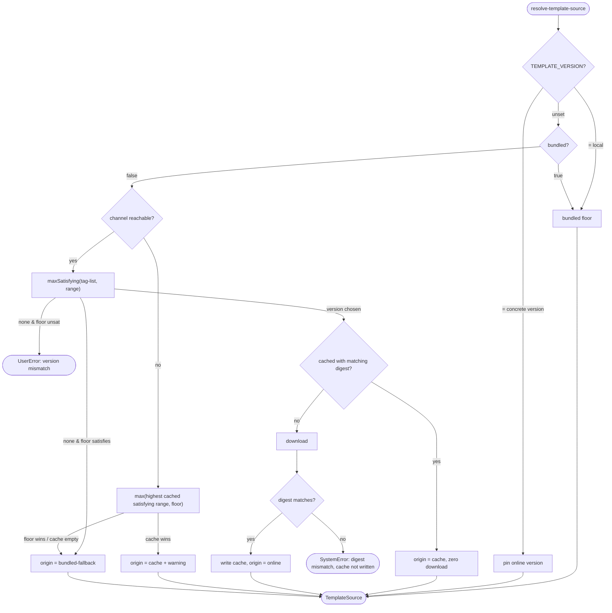

# Operation — `resolve-template-source`

- **Status:** Accepted (Gate 1 + Gate 2 cleared 2026-06-01) — ready for tests
- **Domain:** [`01-scaffolding`](../../domains/01-scaffolding.md)
- **Decision source:** [ADR-0006](../../../02-architecture/adr/ADR-0006-template-distribution-channel.md)
- **Seam:** [`scaffolding.create.proposal.md` §5.2](../../../02-architecture/scaffolding.create.proposal.md)
- **PRD/scenario:** none required — internal, behavior-preserving resolution
  mechanism with no user-visible surface change (see ADR-0006 rollout).

## Purpose

Given a build-pinned `range`, a build-pinned `bundled` flag, and an injected
`runtime`, resolve **exactly one** template source —
`(origin, version, digest, location)` — that a scaffold run will use, before
any template is read or rendered. This is the single decision point that
replaces v3's three `package.json#version`-sniffing call sites.

## Inputs

| Input | Type | Origin |
|-------|------|--------|
| `range` | SemVer range string (e.g. `~6.10`, `>=6.11.0-beta <6.12.0`) | build-time field in `templates-config.json` (reuses existing `version`) |
| `bundled` | boolean | build-time field; `true` for test/offline/daily builds, `false` for shipped builds |
| `port` | narrow `TemplateSourcePort` (`{ env, tagList, packages, cache, floor }`) | injected; an in-memory fake in tests |
| `TEMPLATE_VERSION` | env string, optional | per-invocation override read via `port.env` |

This operation does **not** depend on the full `ScaffoldRuntime`
(`{ fs, http, archive, clock, binaryCache }`, proposal §8). It declares the
narrow `TemplateSourcePort` it actually uses (interface-segregation), which
the full runtime composes later:

| Port face | Shape | Responsibility |
|-----------|-------|----------------|
| `env` | `(name) => string \| undefined` | read `TEMPLATE_VERSION` |
| `tagList` | `() => Promise<Array<{ version: string; digest: string }>>` | the channel's published `{version, digest}` entries (model A — the tag list carries the expected digest per version) |
| `packages` | `(version, expectedDigest) => Promise<bytes>` | download a package; the digest the caller verifies against is the tag-list's expected digest |
| `cache` | `{ get(version): { digest, bytes } \| undefined; put(version, digest, bytes): void; keys(): string[] }` | the local digest-keyed package cache (`keys` enumerates cached versions for the offline `max(cache, floor)` fallback) |
| `floor` | `{ version: string; digest: string; bytes: ... }` | the bundled floor baked into the engine |

## Outputs

A `TemplateSource`:

| Field | Meaning |
|-------|---------|
| `origin` | `bundled \| online \| cache \| bundled-fallback` |
| `version` | the concrete resolved SemVer version |
| `digest` | content hash of the resolved package |
| `location` | where the bytes are (bundled path, cache path, or download URL) |

The resolved `{ version, digest, origin }` is recorded on the scaffold
outcome and telemetry; it is never written back into committed config.

## Resolution precedence

1. `TEMPLATE_VERSION=local` → bundled floor (highest priority; overrides
   `bundled=false`).
2. `TEMPLATE_VERSION=<version>` → that exact online version, pinned.
3. `bundled=true` → bundled floor, no network.
4. `bundled=false` → prefer the highest channel version satisfying `range`,
   with cache and bundled floor as fallbacks.

## Acceptance Criteria

| ID | Tier | Given | When | Then |
|----|------|-------|------|------|
| AC-01 | L1 | `bundled=true`, any `range` | resolve | `origin=bundled`; **no** `runtime.http` call is made; `version`/`digest` = the bundled floor's |
| AC-02 | L1 | `port.env("TEMPLATE_VERSION")="local"`, `bundled=false` | resolve | `origin=bundled`; no network call (override beats `bundled=false`) |
| AC-03 | L1 | `port.env("TEMPLATE_VERSION")="6.11.2"`, `bundled=false`, tag-list lists `6.11.2` with its digest | resolve | resolves online version `6.11.2` pinned; `origin=online`; `digest` = the tag-list's digest for `6.11.2`, recorded |
| AC-04 | L1 | `bundled=false`, tag-list has `6.10.5` (digest `D5`, > floor `6.10.1`) satisfying `~6.10` | resolve | `origin=online`, `version=6.10.5`; `digest=D5` (from tag-list) recorded |
| AC-05 | L1 | `bundled=false`, highest channel version satisfying `range` equals the bundled floor | resolve | resolves to the floor without downloading; `origin=bundled` |
| AC-06 | L1 | `bundled=false`, resolved `version` already in `port.cache` with digest matching the tag-list's | resolve | `origin=cache`; **zero** download; returned bytes are the cached bytes |
| AC-07 | L1 | `bundled=false`, `port.tagList()` is unreachable (network failure, **not** a malformed document), cache holds `6.10.4` satisfying `range`, floor is `6.10.1` | resolve | `origin=cache`, `version=6.10.4` (`max(cache, floor)`); outcome carries an observable warning |
| AC-08 | L1 | `bundled=false`, `port.tagList()` unreachable, cache empty, floor `6.10.1` satisfies `range` | resolve | `origin=bundled-fallback`, `version=6.10.1`; outcome carries an observable warning |
| AC-09 | L1 | `bundled=false`, stable `range` `~6.11`, tag-list has both `6.11.0` and `6.12.0-beta.1` | resolve | resolves `6.11.0`; the `-beta` version is **excluded** |
| AC-10 | L1 | `bundled=false`, beta `range` `>=6.12.0-beta <6.13.0`, tag-list has `6.12.0-beta.1` | resolve | resolves `6.12.0-beta.1` (prerelease included because range names the segment) |
| AC-11 | L1 | `bundled=false`, download succeeds but the bytes' computed digest ≠ the tag-list's expected digest for that version | resolve | raises a `SystemError`; cache is **not** written; corrupt bytes are **never** returned |
| AC-12 | L1 | a build whose `package.json#version` is `"x.y.z-beta"` but `bundled=true` | resolve | `origin=bundled` — resolution does not read `package.json#version` |
| AC-13 | L1 | two resolves with identical `(range, bundled, port, tag-list state)` | resolve twice | both return the identical `{origin, version, digest}` |
| AC-14 | L1 | `bundled=false`, tag-list empty (no version satisfies `range`), floor satisfies `range` | resolve | `origin=bundled-fallback`, `version`=floor; observable warning |
| AC-15 | L1 | `bundled=false`, tag-list empty **and** floor does **not** satisfy `range` | resolve | raises a `UserError` naming the engine/template version mismatch; no silent substitution |
| AC-16 | L1 | `port.env("TEMPLATE_VERSION")="6.99.0"`, `bundled=false`, tag-list does **not** list `6.99.0` | resolve | raises a `UserError` (`TemplatePinnedVersionNotFound`) naming the pinned version; **no** fallback to range resolution, cache, or floor |
| AC-17 | L1 | `bundled=false`, `port.tagList()` rejects with a malformed-document error (`TemplateTagListMalformed`) | resolve | the `SystemError` is **propagated** (returned as `err`); **no** offline fallback — a malformed channel is a hard error (decision #7), distinct from unreachable (AC-07) |
| AC-18 | L1 | `port.env("TEMPLATE_VERSION")="6.11.2"`, `bundled=false`, `port.tagList()` is unreachable/rejects | resolve | returns `err(FxError)` (an existing FxError is preserved; otherwise wrapped); the rejection never escapes as a thrown promise; a pin **never** falls back |
| AC-19 | L1 | `bundled=false`, a version is picked from the tag-list, but `port.packages(...)` (download) rejects | resolve | returns `err(FxError)` (an existing FxError is preserved; otherwise wrapped as `TemplateDownloadFailed`); the rejection never escapes as a thrown promise — the neverthrow contract holds for the download path too |

## Flow

## Boundary

This operation does **not**:

- Parse, validate, or render template content. It resolves *which package*,
  not *what is inside it*. In-package layout (per-template descriptor dirs,
  language dirs) is the consumer's concern.
- Decide `range` or `bundled`. Those are written at build time by the CD
  version step; this operation only reads them.
- Read `package.json#version`. The version-substring sniffing it replaces is
  removed, not relocated here.
- Perform the `minEngineVersion` compatibility check. That gate lives in the
  engine that consumes the resolved package (proposal §5.2 seam contract).
- Publish, tag, or upload anything. It is read-only with respect to the
  release channel; the only thing it writes is the local digest-keyed cache.

## Invariants

- **INV-1 — Never silent.** Any `origin ∈ {cache, bundled-fallback}` reached
  because the intended online source was unavailable emits an observable
  warning on the outcome and a telemetry property; resolution never
  substitutes a different source without recording it.
- **INV-2 — Never sniff `package.json#version`.** Resolution depends only on
  `range`, `bundled`, `runtime`, and `TEMPLATE_VERSION`.
- **INV-3 — Digest integrity.** The tag list publishes a `{version, digest}`
  per version (model A); downloaded bytes are never returned or cached unless
  their computed digest matches the tag-list's expected digest for that
  version; a mismatch is a hard error, not a fallback.
- **INV-4 — Stable excludes prerelease.** A `range` without a prerelease
  segment never resolves a `-beta` version (SemVer `maxSatisfying` semantics).
- **INV-5 — Fallback satisfies `range`.** Every fallback candidate (cache
  entry, bundled floor) is checked against `range`; a candidate that does not
  satisfy `range` is never chosen — if none satisfies, it is a `UserError`,
  not a silent best-effort.
- **INV-6 — Determinism.** Given identical inputs and identical channel state,
  resolution is a pure function of them: same `{origin, version, digest}`.
- **INV-7 — v4-owned.** This operation and its tests live in the v4 world; v3
  may call it, but it adds no v3-specific method, parameter, or test fixture
  (proposal §5.1 seam direction).

## Resolved decisions (Gate 1)

1. **Cache TTL for the tag-list refetch — out of scope.** This operation stays
   a pure function of the *current* tag-list state (INV-6, AC-13); it does not
   introduce a time window. A TTL is an orthogonal `runtime.http`/cache-layer
   optimization tracked separately, not part of this decision function.
2. **`bundled-fallback` vs `cache` tie at equal versions → `bundled-fallback`.**
   When the highest cached version equals the bundled floor version, attribute
   the result to the bundled floor (the more conservative origin).
3. **Telemetry — `package-source` and `origin` coexist (transition).** Emit
   both the existing `package-source` property and the new `origin` property
   during the transition window, with identical values
   (`bundled | online | cache | bundled-fallback`); `package-source` is removed
   once consumers have migrated to `origin`.
4. **Expected digest comes from the tag list (model A).** The published tag
   list is a list of `{version, digest}` entries, not bare versions. Every
   online resolve has an a-priori expected digest to verify the downloaded
   bytes against (INV-3, AC-11), and the cache key is trustworthy. This is a
   **new** channel artifact: the v3 bare-version tag-list URL is never altered
   (ADR-0006 v3-non-blocking constraint); model A ships a separate
   digest-bearing list for v4.
5. **v4 uses a dedicated `templates-v4@` tag prefix.** v4 template releases
   publish under `templates-v4@<version>` on a separate tag list (mirroring
   the existing `templates-vs@` split), so a v3 `templates@` client can never
   resolve a v4 version *regardless of version number* (ADR-0006 channel
   isolation). v4 versions therefore stay in sync with the engine's `6.x`
   line; no MAJOR jump. `location` / cache keys use the `templates-v4@`
   prefix.
6. **`digest` = `sha256` of the package `.zip` raw bytes.** The digest is the
   `sha256` hash of the exact downloaded `.zip` byte stream, prefixed
   `sha256:`. The publish side computes it over the same artifact bytes; any
   single-byte difference (zip metadata, line endings) is a deliberate
   mismatch, not tolerated. `computeDigest(bytes)` is the one authority.
7. **The v4 tag list is NDJSON.** The model-A tag list is newline-delimited
   JSON: one `{"version":"6.11.0","digest":"sha256:…"}` object per line.
   Blank lines and `\r` are ignored; a malformed line is a hard parse error
   (no silent skip). Served at a **new** URL (`templatesV4TagListURL`),
   separate from the frozen v3 `tagListURL`.
