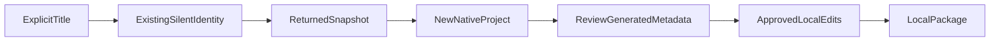

# Clone a returned launch-info snapshot

**Status:** Approved implementation contract.
**Scenario ID:** SCN-AGENT-TITLE.
**Domain:** Agent-package graduation.
**Workflow:** An explicitly supplied Title ID produces a new native project from
the returned accessible DA snapshot, followed by separate approved local edits.

The source is launch-info content, not an original ZIP or an authoring draft.
The user must already have a selected authenticated native account. Source
authorization is not a grant for referenced knowledge/resources.

## Composed operations

- [Import from Title ID](../../operations/scaffolding/import-agent-from-title.md)
- [Approved local edits](../../operations/scaffolding/apply-agent-edits.md)

## Acceptance Criteria

| ID | Runtime | Purpose | Gate | Harness | Given / when | Then |
|---|---|---|---|---|---|---|
| SCN-AGENT-TITLE-01 | L1 | scenario | required | Public client + synthetic HTTP + native package | Title import, local edit/no-op, package using explicit fixture bindings | Exact snapshot instructions/color/capabilities before edits and approved result after; new identities and historical provenance |
| SCN-AGENT-TITLE-02 | L2 | surface | required | Native CLI harness | Explicit --title-id or --source with JSON | Authenticated read-only v2 path or unchanged local v1 path; neither silently switches source or auth provider |

## Flow

## Boundary

No source updates, real tenant tests, automatic authentication, resource copying,
tenant discovery, or deployment. The operation's atomic-action criteria are
owned by its linked spec, not duplicated here.
